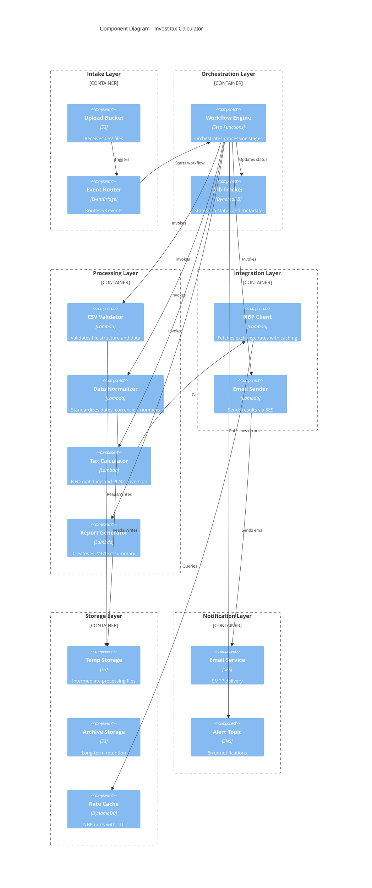

# Component Architecture

[← Back to Index](README.md)

## Component Diagram



---

## Overview

The InvestTax Calculator is organized into **6 logical layers** with clearly defined responsibilities. This layered architecture promotes separation of concerns, independent scaling, and isolated testing.

**Design Principle**: Each component is a single-responsibility microservice communicating via events and function invocations.

---

## Layer 1: Intake Layer

### Purpose
Accepts file uploads and routes events to processing pipeline.

---

### Component: Upload Bucket (S3)
**Technology**: Amazon S3  
**Name**: `investtax-upload-{stage}`  
**Responsibility**: Entry point for all user file uploads

**Configuration**:
- **Encryption**: SSE-S3 (AES-256)
- **Versioning**: Disabled (single-use files)
- **Lifecycle Policy**: Delete after 7 days
- **Event Notifications**: PUT events trigger EventBridge

**Object Metadata Requirements**:
- **Key**: `x-amz-meta-email` (required)
- **Value**: User email address for results delivery
- **Example**: `user@example.com`

**File Patterns**:
- **Path**: `{year}/{uuid}.csv` (e.g., `2024/550e8400-e29b-41d4-a716-446655440000.csv`)
- **Size Limit**: 100 MB (enforced by S3 bucket policy)
- **Format**: Pipe-delimited CSV with specific headers

**Security**:
- Block public access enabled
- IAM policy restricts write to specific principals
- Server-side encryption mandatory

---

### Component: Event Router (EventBridge)
**Technology**: Amazon EventBridge  
**Name**: `default` event bus  
**Responsibility**: Routes S3 upload events to Step Functions

**Event Rule**:
```json
{
  "source": ["aws.s3"],
  "detail-type": ["Object Created"],
  "detail": {
    "bucket": { "name": ["investtax-upload-prod"] }
  }
}
```

**Target**: Step Functions state machine ARN  
**Transformation**: Passes S3 event detail to workflow input

**Why EventBridge over Lambda trigger?**
- Cleaner separation: S3 → Events → Processing
- Easier to add additional triggers (scheduled jobs, manual invocations)
- Built-in filtering and transformation
- Event replay capability for debugging

---

## Layer 2: Orchestration Layer

### Purpose
Manages workflow state, coordinates processing stages, and tracks job metadata.

---

### Component: Workflow Engine (Step Functions)
**Technology**: AWS Step Functions (Standard Workflow)  
**Name**: `InvestTax-ProcessingWorkflow`  
**Responsibility**: Orchestrates 8-stage processing pipeline

**Workflow Stages**:
1. Extract Metadata → Create job record
2. Validate CSV → Structure and data validation
3. Normalize Data → Standardize formats
4. Fetch NBP Rates → Exchange rate retrieval
5. Calculate Tax → FIFO matching engine
6. Generate Report → HTML/text report
7. Send Email → SES delivery
8. Archive & Cleanup → Move to archive, delete temp files

**State Machine Type**: Standard (long-running, exactly-once execution)

**Error Handling**:
- **Retry Policy**: 3 attempts with exponential backoff (1-2-4 seconds)
- **Catch Blocks**: Send error email on validation/rate fetch failure
- **Timeout**: 15 minutes total workflow timeout

**Execution Input**:
```json
{
  "bucket": "investtax-upload-prod",
  "key": "2024/550e8400-e29b-41d4-a716-446655440000.csv",
  "email": "user@example.com",
  "uploadTime": "2025-01-15T10:30:00Z"
}
```

**Execution Output**:
```json
{
  "jobId": "550e8400-e29b-41d4-a716-446655440000",
  "status": "SUCCESS",
  "totalGain": 15000.50,
  "totalTax": 2850.09,
  "transactionCount": 234
}
```

**Why Step Functions?**
- Visual workflow representation (easy debugging)
- Built-in retry and error handling
- Maintains execution history (90 days)
- No custom orchestration code needed
- Integrates natively with Lambda, DynamoDB, SES

---

### Component: Job Tracker (DynamoDB)
**Technology**: Amazon DynamoDB  
**Table Name**: `InvestTax-Jobs`  
**Responsibility**: Stores job status, metadata, and execution details

**Schema**:
| Attribute | Type | Description |
|-----------|------|-------------|
| `job_id` (PK) | String | UUID from filename |
| `email` | String | User email address |
| `upload_time` | String | ISO timestamp of upload |
| `status` | String | PENDING\|PROCESSING\|SUCCESS\|FAILED |
| `stage` | String | Current processing stage |
| `file_key` | String | S3 object key |
| `year` | Number | Tax year (extracted from file) |
| `transaction_count` | Number | Total rows processed |
| `total_gain_pln` | Number | Calculated total gain |
| `total_tax_pln` | Number | Calculated total tax (19%) |
| `error_message` | String | Error details if failed |
| `completed_time` | String | ISO timestamp of completion |
| `ttl` | Number | DynamoDB TTL (30 days after completion) |

**Indexes**:
- **GSI**: `email-upload_time-index` (query jobs by user email)

**Capacity Mode**: On-Demand (pay per request)

**Retention**: 30-day TTL removes old job records automatically

**Usage**:
- Created at workflow start (status=PENDING)
- Updated after each stage (status=PROCESSING, stage="VALIDATION")
- Final update on success (status=SUCCESS, totals populated)
- Error update on failure (status=FAILED, error_message set)

**Why DynamoDB?**
- Serverless, auto-scaling
- Built-in TTL for automatic cleanup
- Point-in-time recovery for data durability
- Single-millisecond read latency
- Cheap for low-volume use case

---

## Layer 3: Processing Layer

### Purpose
Core business logic for validation, normalization, calculation, and reporting.

---

### Component: CSV Validator
**Technology**: AWS Lambda (Python 3.12)  
**Name**: `InvestTax-ValidateCSV`  
**Responsibility**: Validates file structure, headers, and data types

**Memory**: 512 MB  
**Timeout**: 5 minutes  
**Runtime**: Python 3.12

**Validation Rules**:

**1. File Structure**:
- ✅ Valid UTF-8 encoding
- ✅ Pipe-delimited (|) separator
- ✅ Minimum 2 rows (header + 1 data row)
- ✅ Maximum 100,000 rows

**2. Header Validation**:
- Required columns (exact names):
  - `Action`, `Time`, `ISIN`, `Ticker`, `No. of shares`, `Price / share`, `Currency symbol`, `Exchange rate`, `Total`
- ⚠️ Extra columns allowed (ignored)

**3. Data Type Validation** (per row):
- `Action`: Must be "Market buy" or "Market sell"
- `Time`: Valid ISO 8601 datetime
- `ISIN`: 12-character alphanumeric (e.g., US0378331005)
- `No. of shares`: Positive decimal number
- `Price / share`: Positive decimal number
- `Currency symbol`: 3-letter ISO code (USD, EUR, GBP, etc.)
- `Total`: Numeric (matches calculated shares * price)

**4. Business Rule Validation**:
- ✅ At least one "Market buy" transaction
- ✅ Sell quantity ≤ total available shares (FIFO check)
- ✅ All dates within single calendar year
- ✅ Transaction dates not in future

**Output on Success**:
```json
{
  "valid": true,
  "rowCount": 234,
  "year": 2024,
  "currencies": ["USD", "EUR"],
  "validatedFileKey": "temp/validated-550e8400.csv"
}
```

**Output on Failure**:
```json
{
  "valid": false,
  "errors": [
    {"row": 15, "column": "Time", "message": "Invalid date format"},
    {"row": 23, "column": "No. of shares", "message": "Must be positive"}
  ]
}
```

**Error Handling**:
- Returns validation errors to Step Functions
- Step Functions sends error email to user with row/column details
- User can fix file and re-upload

**Dependencies**:
- Python `csv` module
- `pandas` for data type validation
- `boto3` for S3 read/write

---

### Component: Data Normalizer
**Technology**: AWS Lambda (Python 3.12)  
**Name**: `InvestTax-NormalizeData`  
**Responsibility**: Standardizes dates, numbers, and currencies

**Memory**: 1024 MB  
**Timeout**: 10 minutes

**Transformations**:

**1. Date Normalization**:
- Parse ISO 8601 strings to `datetime` objects
- Convert to Europe/Warsaw timezone
- Extract date-only for NBP rate lookup

**2. Number Normalization**:
- Parse string decimals to `Decimal` (avoid floating-point errors)
- Round to 2 decimal places for currency
- Preserve full precision for share quantities

**3. Currency Normalization**:
- Uppercase currency codes (usd → USD)
- Validate against ISO 4217 list
- Map to NBP currency codes (EUR → EUR, USD → USD)

**4. Transaction Grouping**:
- Sort by timestamp (earliest first)
- Group by ISIN/Ticker for FIFO matching
- Assign sequential IDs within each group

**Output**:
```json
{
  "normalizedFileKey": "temp/normalized-550e8400.json",
  "transactionGroups": {
    "US0378331005": {
      "ticker": "AAPL",
      "transactions": [
        {
          "id": 1,
          "action": "BUY",
          "date": "2024-03-15",
          "shares": 10,
          "pricePerShare": 170.50,
          "currency": "USD"
        }
      ]
    }
  }
}
```

**Why JSON output?**
- Easier for downstream Lambdas to parse
- Preserves data types (no string conversions)
- Smaller file size than CSV
- Supports nested structures (transaction groups)

---

### Component: Tax Calculator
**Technology**: AWS Lambda (Python 3.12)  
**Name**: `InvestTax-CalculateTax`  
**Responsibility**: FIFO matching, PLN conversion, tax calculation

**Memory**: 2048 MB (highest memory for performance)  
**Timeout**: 10 minutes

**Algorithm**: FIFO (First In, First Out) Matching

**Process**:
1. For each sell transaction:
   - Find earliest unmatched buy (same ISIN)
   - Match shares (partial if needed)
   - Calculate gain = sell_price_pln - buy_price_pln
   - Accumulate total gain

2. Convert prices to PLN:
   - Retrieve NBP rate for transaction date
   - If rate missing, fail with error
   - PLN value = price * shares * rate

3. Apply tax rules:
   - Capital gains tax = 19% of total gain
   - No deductions or loss carryforward (Phase 1 simplification)

**Example**:
```
Buy 10 AAPL @ $150 on 2024-01-15 (rate: 4.00 PLN/USD)
  → Cost basis: 10 * 150 * 4.00 = 6,000 PLN

Sell 5 AAPL @ $170 on 2024-06-20 (rate: 4.10 PLN/USD)
  → Proceeds: 5 * 170 * 4.10 = 3,485 PLN
  → Cost: 5 * 150 * 4.00 = 3,000 PLN
  → Gain: 3,485 - 3,000 = 485 PLN

Sell 5 AAPL @ $180 on 2024-12-01 (rate: 4.15 PLN/USD)
  → Proceeds: 5 * 180 * 4.15 = 3,735 PLN
  → Cost: 5 * 150 * 4.00 = 3,000 PLN
  → Gain: 3,735 - 3,000 = 735 PLN

Total Gain: 485 + 735 = 1,220 PLN
Tax (19%): 231.80 PLN
```

**Output**:
```json
{
  "totalGainPLN": 1220.00,
  "totalTaxPLN": 231.80,
  "transactionDetails": [
    {
      "buy": {...},
      "sell": {...},
      "gainPLN": 485.00
    }
  ]
}
```

**Performance**:
- 10K transactions: ~30 seconds
- 100K transactions: ~5 minutes
- Bottleneck: NBP rate lookups (mitigated by caching)

---

### Component: Report Generator
**Technology**: AWS Lambda (Python 3.12)  
**Name**: `InvestTax-GenerateReport`  
**Responsibility**: Creates human-readable HTML and plain text reports

**Memory**: 512 MB  
**Timeout**: 3 minutes

**Report Formats**:

**1. HTML Version** (for rich email clients):
- Styled tables with transaction details
- Color-coded gains (green) and losses (red - Phase 2)
- Summary statistics (total gain, tax, transaction count)
- Disclaimer and methodology explanation
- Bootstrap CSS for responsive design

**2. Plain Text Version** (for fallback):
- ASCII table formatting
- Same content as HTML, no styling
- Ensures deliverability for text-only email clients

**Report Sections**:
1. **Summary**:
   - Tax Year
   - Total Capital Gain (PLN)
   - Total Tax Owed (PLN)
   - Number of Transactions

2. **Matched Transactions** (FIFO pairs):
   - Buy Date, Ticker, Shares, Buy Price (original + PLN)
   - Sell Date, Sell Price (original + PLN)
   - Gain/Loss per matched pair

3. **Methodology**:
   - FIFO explanation
   - NBP rate usage
   - 19% flat tax rate

4. **Disclaimer**:
   - Not tax advice
   - User responsibility to verify
   - Consult tax professional

**Template Engine**: Jinja2 for HTML generation

**Output**:
```json
{
  "htmlReportKey": "temp/report-550e8400.html",
  "textReportKey": "temp/report-550e8400.txt"
}
```

---

## Layer 4: Integration Layer

### Purpose
Handles external integrations (NBP API, email delivery).

---

### Component: NBP Client
**Technology**: AWS Lambda (Python 3.12)  
**Name**: `InvestTax-FetchNBPRates`  
**Responsibility**: Fetches and caches PLN exchange rates

**Memory**: 256 MB (lightweight)  
**Timeout**: 5 minutes

**NBP API Details**:
- **Endpoint**: `https://api.nbp.pl/api/exchangerates/rates/a/{currency}/{date}/`
- **Example**: `https://api.nbp.pl/api/exchangerates/rates/a/USD/2024-03-15/`
- **Response**:
  ```json
  {
    "table": "A",
    "currency": "dolar amerykański",
    "code": "USD",
    "rates": [{"no": "052/A/NBP/2024", "effectiveDate": "2024-03-15", "mid": 3.9876}]
  }
  ```

**Caching Logic**:
1. Check DynamoDB cache for (currency, date) pair
2. If found and not expired (TTL > now):
   - Return cached rate
3. If not found or expired:
   - Call NBP API
   - Store in cache with 30-day TTL
   - Return rate

**Cache Table** (`InvestTax-NBP-Rates`):
| Attribute | Type | Description |
|-----------|------|-------------|
| `cache_key` (PK) | String | `{currency}#{date}` (e.g., USD#2024-03-15) |
| `rate` | Number | Mid rate from NBP |
| `fetched_at` | String | ISO timestamp of fetch |
| `ttl` | Number | Unix timestamp (30 days from fetch) |

**Error Handling**:
- **404 (Rate Unavailable)**: NBP has no rate for that date (weekend/holiday)
  - Return error to calculator
  - Calculator fails workflow
  - Error email sent to user: "NBP rate unavailable for USD on 2024-12-25 (Sunday)"
- **429 (Rate Limit)**: Back off 5 seconds, retry
- **5xx (Server Error)**: Retry 3 times with exponential backoff

**Optimization**:
- **Batch Fetching**: Fetch all unique (date, currency) pairs in parallel
  - Example: 100 transactions with 20 unique dates → 20 parallel API calls
  - Reduces latency from ~10 seconds to ~2 seconds
- **Connection Pooling**: Reuse HTTP connections for NBP API
- **Lambda Layer**: Share `requests` library across invocations

**Cache Hit Rate**: 80-95% (most files have common dates like year-end)

---

### Component: Email Sender
**Technology**: AWS Lambda (Python 3.12)  
**Name**: `InvestTax-SendEmail`  
**Responsibility**: Delivers success and error emails via SES

**Memory**: 256 MB  
**Timeout**: 2 minutes

**SES Configuration**:
- **Region**: eu-central-1 (Frankfurt)
- **From Address**: `noreply@investtax.example.com` (verified in SES)
- **Reply-To**: `support@investtax.example.com`
- **Configuration Set**: `InvestTax-Emails` (for bounce/complaint tracking)

**Email Templates**:

**Success Email**:
- **Subject**: `Your InvestTax PIT-38 Calculation Results - {year}`
- **Body**: HTML + plain text (from Report Generator)
- **Size**: Typically 50-200 KB

**Error Email**:
- **Subject**: `InvestTax Processing Error - Action Required`
- **Body**: 
  - User-friendly explanation of error
  - Specific validation failures or missing rates
  - Instructions for fixing and re-uploading
  - Support contact information

**Delivery**:
- **Protocol**: SMTP over TLS (STARTTLS)
- **Authentication**: IAM role (no credentials needed)
- **Retry**: SES handles retries (up to 12 hours)
- **Bounce Handling**: SNS topic notified of bounces

**Compliance**:
- **CAN-SPAM**: Includes unsubscribe link (no-op for transactional email)
- **GDPR**: Email only used for delivery, not stored long-term

**Monitoring**:
- CloudWatch metric: Email success/failure rate
- Alarm on > 5% failure rate

---

## Layer 5: Storage Layer

### Purpose
Persistent and temporary data storage.

---

### Component: Temp Storage (S3)
**Technology**: Amazon S3  
**Bucket Name**: `investtax-temp-{stage}`  
**Responsibility**: Intermediate processing files

**Lifecycle Policy**: Delete all objects after 1 day

**File Patterns**:
- `validated-{job_id}.csv`: Post-validation file
- `normalized-{job_id}.json`: Post-normalization data
- `report-{job_id}.html`: Generated HTML report
- `report-{job_id}.txt`: Generated plain text report

**Why separate temp bucket?**
- Clear separation from upload and archive
- Aggressive lifecycle policy (1 day vs. 7-30 days)
- Easier to monitor temp file growth
- Security: No user access needed

---

### Component: Archive Storage (S3)
**Technology**: Amazon S3  
**Bucket Name**: `investtax-archive-{stage}`  
**Responsibility**: Long-term retention of processed files

**Lifecycle Policy**:
- **Days 0-30**: Standard storage
- **Days 30-90**: Standard-IA (infrequent access)
- **Days 90+**: Glacier Instant Retrieval
- **Day 365**: Delete (configurable)

**File Patterns**:
- `{year}/{job_id}/original.csv`: Original uploaded file
- `{year}/{job_id}/report.html`: Final report
- `{year}/{job_id}/calculation.json`: Full calculation details

**Use Cases**:
- Audit trail for tax filings
- User re-download requests (Phase 2 feature)
- Debugging calculation errors

**Access Control**: Read-only for Lambda functions, no user access

---

### Component: Rate Cache (DynamoDB)
**Technology**: Amazon DynamoDB  
**Table Name**: `InvestTax-NBP-Rates`  
**Responsibility**: Caches NBP exchange rates

**Schema** (see NBP Client section above)

**TTL**: 30 days (rates are historical and immutable)

**Capacity**: On-Demand (very low volume)

**Monitoring**: CloudWatch alarm if read latency > 10ms (indicates throttling)

---

## Layer 6: Notification Layer

### Purpose
Email delivery and error alerting.

---

### Component: Email Service (SES)
**Technology**: Amazon SES  
**Configuration Set**: `InvestTax-Emails`  
**Responsibility**: SMTP delivery to user inboxes

**Verified Identities**:
- Domain: `investtax.example.com` (DKIM, SPF, DMARC configured)
- Email: `noreply@investtax.example.com`

**Sending Quota** (production):
- Max send rate: 14 emails/second (default)
- 24-hour quota: 50,000 emails (default)
- Request increase if needed (unlikely for this use case)

**Bounce/Complaint Handling**:
- SNS topic: `InvestTax-EmailBounces`
- Lambda function logs bounced emails
- Future: Implement email suppression list

---

### Component: Alert Topic (SNS)
**Technology**: Amazon SNS  
**Topic Name**: `InvestTax-Errors`  
**Responsibility**: Notifies admins of system errors

**Subscriptions**:
- Email: `alerts@investtax.example.com`
- (Future) Slack webhook for real-time notifications

**Error Scenarios**:
- NBP API consistently failing (> 10 failures/hour)
- Step Functions workflow timeout
- DynamoDB throttling
- SES bounce rate > 5%

**Message Format**:
```json
{
  "severity": "ERROR",
  "component": "NBP-Client",
  "message": "NBP API returned 503 for 15 consecutive requests",
  "timestamp": "2025-01-15T14:30:00Z",
  "context": {
    "jobId": "550e8400-e29b-41d4-a716-446655440000",
    "currency": "USD",
    "date": "2024-12-25"
  }
}
```

---

## Cross-Cutting Concerns

### Logging
**Service**: Amazon CloudWatch Logs  
**Strategy**: Structured JSON logging

**Log Groups**:
- `/aws/lambda/InvestTax-ValidateCSV`
- `/aws/lambda/InvestTax-NormalizeData`
- `/aws/lambda/InvestTax-CalculateTax`
- `/aws/lambda/InvestTax-FetchNBPRates`
- `/aws/lambda/InvestTax-GenerateReport`
- `/aws/lambda/InvestTax-SendEmail`
- `/aws/stepfunctions/InvestTax-ProcessingWorkflow`

**Retention**: 30 days (configurable)

**Log Format**:
```json
{
  "timestamp": "2025-01-15T10:30:15.123Z",
  "level": "INFO",
  "jobId": "550e8400-e29b-41d4-a716-446655440000",
  "component": "Calculator",
  "message": "Starting FIFO calculation",
  "context": {
    "transactionCount": 234,
    "year": 2024
  }
}
```

---

### Monitoring
**Service**: Amazon CloudWatch Metrics + Alarms

**Key Metrics**:
| Metric | Threshold | Alarm Action |
|--------|-----------|--------------|
| Lambda errors | > 5% | SNS alert |
| Step Functions failed executions | > 3/hour | SNS alert |
| DynamoDB throttled requests | > 0 | SNS alert |
| SES bounce rate | > 5% | SNS alert |
| NBP API error rate | > 10% | SNS alert |

**Dashboard**: Custom CloudWatch dashboard with:
- Total jobs processed (daily)
- Success vs. failure rate
- Average processing time
- NBP cache hit rate

---

### Distributed Tracing
**Service**: AWS X-Ray

**Enabled For**: All Lambda functions and Step Functions

**Use Cases**:
- Identify bottlenecks (which stage takes longest?)
- Debug failures (trace job from upload to email)
- Analyze NBP API latency
- Optimize Lambda cold starts

**Sample Trace**:
```
S3 Upload → EventBridge (5ms) → Step Functions (10ms)
  → Validate (2.3s)
  → Normalize (1.8s)
  → Fetch NBP (0.5s, 95% cached)
  → Calculate (3.2s)
  → Generate Report (1.1s)
  → Send Email (0.8s)
Total: 9.7s
```

---

### Security
**Principles**:
- **Least Privilege**: Each Lambda has minimal IAM permissions
- **Encryption**: All data encrypted at rest (S3, DynamoDB)
- **Network Isolation**: (Phase 2) Lambda in VPC with NAT Gateway for NBP
- **Secrets**: No hardcoded credentials (IAM roles for AWS services)

**IAM Role Example** (Calculator Lambda):
```json
{
  "Effect": "Allow",
  "Action": [
    "s3:GetObject",
    "s3:PutObject"
  ],
  "Resource": [
    "arn:aws:s3:::investtax-temp-prod/*"
  ]
}
```

---

## Data Flow Between Components

```
1. User → Upload Bucket (S3)
2. Upload Bucket → EventBridge (S3 event)
3. EventBridge → Step Functions (start execution)
4. Step Functions → Job Tracker (create job record)
5. Step Functions → Validator → Temp Bucket (read upload, write validated)
6. Step Functions → Normalizer → Temp Bucket (read validated, write normalized)
7. Step Functions → NBP Client → Rate Cache (query cache)
8. NBP Client → NBP API (if cache miss)
9. Step Functions → Calculator → NBP Client (get rates)
10. Calculator → Temp Bucket (write calculation results)
11. Step Functions → Report Generator → Temp Bucket (read calc, write reports)
12. Step Functions → Email Sender → SES (send email)
13. SES → User Email (SMTP delivery)
14. Step Functions → Job Tracker (mark complete)
15. Step Functions → Archive Bucket (move files from temp/upload)
16. Step Functions → Temp Bucket (delete temp files)
```

---

## Component Scaling Characteristics

| Component | Scaling Strategy | Max Concurrent |
|-----------|------------------|----------------|
| Upload Bucket | Unlimited | N/A (S3 auto-scales) |
| Step Functions | 1 per file | 1000 (default account limit) |
| Lambda (all) | Auto-scale per invocation | 1000 concurrent (default) |
| DynamoDB | On-Demand | Unlimited |
| SES | Rate-limited | 14 emails/sec (default) |

**Bottleneck**: NBP API rate limits (unknown, estimated ~100 req/s)

---

## Deployment Considerations

### Infrastructure as Code
**Tool**: AWS CDK (C# preferred)

**Stacks**:
1. **Storage Stack**: S3 buckets, DynamoDB tables
2. **Compute Stack**: Lambda functions, Lambda layers
3. **Orchestration Stack**: Step Functions state machine
4. **Notification Stack**: SES, SNS topics
5. **Monitoring Stack**: CloudWatch dashboards, alarms

**Why CDK over CloudFormation templates?**
- Type-safe constructs
- Reusable components
- Easier to refactor
- Built-in best practices (encryption, logging)

---

### CI/CD Pipeline
**Tool**: AWS CodePipeline + CodeBuild

**Stages**:
1. **Source**: GitHub commit triggers pipeline
2. **Test**: Run unit tests (pytest), lint (pylint, black)
3. **Build**: Package Lambda functions, synthesize CloudFormation
4. **Deploy Dev**: Deploy to development account
5. **Integration Test**: Run E2E tests with sample files
6. **Deploy Prod**: Manual approval → Production deployment

**Rollback**: CloudFormation stack rollback on failure

---

## Next Steps

- **Data Processing**: See [Data Flow](data-flow.md) for stage-by-stage transformation details
- **User Journeys**: Review [Workflows](workflows.md) for sequence diagrams
- **Deployment**: Check [Deployment Architecture](deployment-architecture.md) for infrastructure diagram

---

[← Back to Index](README.md) | [← Previous: System Context](system-context.md) | [Next: Deployment Architecture →](deployment-architecture.md)
