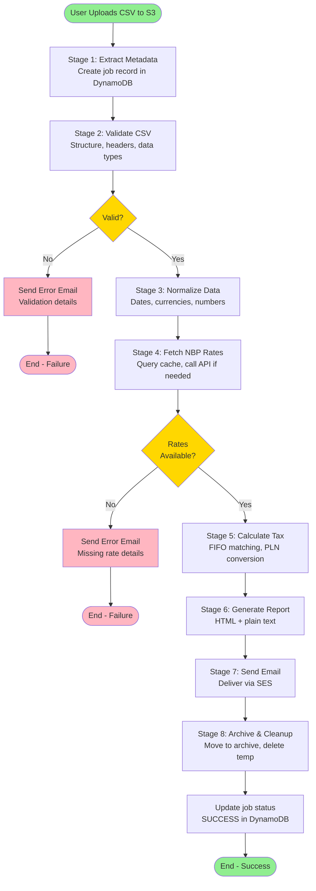

# Data Flow

[← Back to Index](README.md)

## Data Flow Diagram



---

## Overview

The InvestTax Calculator processes files through **8 sequential stages**, transforming raw CSV data into tax calculation summaries delivered via email. Each stage performs a specific transformation, with validation and error handling at every step.

**Key Characteristic**: Pipeline is **sequential** (not parallel) to ensure data integrity and simplify debugging.

---

## Stage 1: Extract Metadata

### Purpose
Initialize job tracking and extract file metadata.

### Input
- **S3 Event** from EventBridge:
  ```json
  {
    "bucket": "investtax-upload-prod",
    "key": "2024/550e8400-e29b-41d4-a716-446655440000.csv",
    "size": 524288,
    "eventTime": "2025-01-15T10:30:00Z"
  }
  ```
- **S3 Object Metadata**:
  - `x-amz-meta-email`: User email address

### Processing
1. Parse S3 event details
2. Extract job ID from filename (UUID)
3. Read email from S3 object metadata
4. Extract year from filename path (`2024/...`)
5. Create job record in DynamoDB

### Output
- **DynamoDB Record** (InvestTax-Jobs):
  ```json
  {
    "job_id": "550e8400-e29b-41d4-a716-446655440000",
    "email": "user@example.com",
    "upload_time": "2025-01-15T10:30:00Z",
    "status": "PENDING",
    "stage": "METADATA_EXTRACTED",
    "file_key": "2024/550e8400-e29b-41d4-a716-446655440000.csv",
    "year": 2024,
    "file_size": 524288
  }
  ```

### Error Handling
- **Missing email metadata**: Send generic error email to support
- **DynamoDB write failure**: Retry 3 times, then fail workflow

### Duration
~500ms (mostly DynamoDB latency)

---

## Stage 2: Validate CSV

### Purpose
Ensure file meets structural and data type requirements before processing.

### Input
- **S3 Object**: `s3://investtax-upload-prod/2024/550e8400-e29b-41d4-a716-446655440000.csv`
- **Job Metadata**: Job ID, email, year

### Processing

**Step 1: Download File from S3**
```python
s3_client.download_file(
    Bucket='investtax-upload-prod',
    Key='2024/550e8400-e29b-41d4-a716-446655440000.csv',
    Filename='/tmp/input.csv'
)
```

**Step 2: File-Level Validation**
- ✅ File size < 100 MB
- ✅ UTF-8 encoding
- ✅ Pipe-delimited (|) separator
- ✅ At least 2 rows (header + 1 data row)
- ✅ Max 100,000 rows

**Step 3: Header Validation**
Required columns (exact names, order-independent):
- `Action`
- `Time`
- `ISIN`
- `Ticker`
- `Name`
- `No. of shares`
- `Price / share`
- `Currency symbol`
- `Exchange rate`
- `Result`
- `Total`
- `Notes`

**Step 4: Row-by-Row Validation**
For each data row:

| Column | Validation Rule | Example Valid | Example Invalid |
|--------|----------------|---------------|-----------------|
| `Action` | Must be "Market buy" or "Market sell" | Market buy | Buy |
| `Time` | Valid ISO 8601 datetime | 2024-03-15T14:30:00.000 | 03/15/2024 |
| `ISIN` | 12-char alphanumeric, valid checksum | US0378331005 | US037833 |
| `Ticker` | 1-10 uppercase letters | AAPL | apple123 |
| `No. of shares` | Positive decimal | 10.5 | -5 |
| `Price / share` | Positive decimal | 170.50 | $170.50 |
| `Currency symbol` | 3-letter ISO code | USD | Dollar |
| `Exchange rate` | Positive decimal (ignored) | 1 | N/A |
| `Total` | Numeric | 1789.25 | - |

**Step 5: Business Rule Validation**
- All transactions in same calendar year (from filename year)
- At least one "Market buy" transaction
- No transaction dates in future
- Sell quantities don't exceed available shares (preliminary FIFO check)

**Step 6: Extract File Statistics**
- Row count
- Unique currencies
- Date range
- Unique ISINs/tickers

### Output (Success)
- **Validated File** written to: `s3://investtax-temp-prod/validated-550e8400.csv`
- **Validation Summary**:
  ```json
  {
    "valid": true,
    "rowCount": 234,
    "year": 2024,
    "currencies": ["USD", "EUR", "GBP"],
    "dateRange": {"start": "2024-01-05", "end": "2024-12-20"},
    "tickers": ["AAPL", "GOOGL", "MSFT", "TSLA"],
    "validatedFileKey": "validated-550e8400.csv"
  }
  ```

### Output (Failure)
- **Validation Errors**:
  ```json
  {
    "valid": false,
    "errors": [
      {
        "row": 15,
        "column": "Time",
        "value": "03/15/2024",
        "message": "Invalid date format. Expected ISO 8601 (YYYY-MM-DDTHH:MM:SS)"
      },
      {
        "row": 23,
        "column": "No. of shares",
        "value": "-10",
        "message": "Must be a positive number"
      },
      {
        "row": 45,
        "column": "Currency symbol",
        "value": "Dollar",
        "message": "Invalid currency code. Expected 3-letter ISO code (e.g., USD, EUR)"
      }
    ]
  }
  ```

### Error Handling
- **Validation Errors**: Return to Step Functions → Send error email with row/column details
- **S3 Read Failure**: Retry 3 times, then fail
- **File Too Large**: Return error immediately (no processing)

### Duration
- Small file (100 rows): ~2 seconds
- Medium file (10K rows): ~20 seconds
- Large file (100K rows): ~3 minutes

---

## Stage 3: Normalize Data

### Purpose
Standardize data formats, convert types, and group transactions by security.

### Input
- **Validated CSV**: `s3://investtax-temp-prod/validated-550e8400.csv`
- **Validation Summary**: Row count, currencies, year

### Processing

**Step 1: Load Validated CSV**
```python
import pandas as pd
df = pd.read_csv('s3://investtax-temp-prod/validated-550e8400.csv', sep='|')
```

**Step 2: Date Normalization**
```python
# Parse ISO 8601 strings to datetime objects
df['Time'] = pd.to_datetime(df['Time'], format='ISO8601')

# Convert to Europe/Warsaw timezone
df['Time'] = df['Time'].dt.tz_convert('Europe/Warsaw')

# Extract date-only for NBP rate lookup
df['Date'] = df['Time'].dt.date
```

**Step 3: Number Normalization**
```python
from decimal import Decimal

# Convert string decimals to Decimal (avoid floating-point errors)
df['No. of shares'] = df['No. of shares'].apply(Decimal)
df['Price / share'] = df['Price / share'].apply(lambda x: Decimal(x).quantize(Decimal('0.01')))
df['Total'] = df['Total'].apply(lambda x: Decimal(x).quantize(Decimal('0.01')))
```

**Step 4: Currency Normalization**
```python
# Uppercase currency codes
df['Currency symbol'] = df['Currency symbol'].str.upper()

# Validate against ISO 4217 list
valid_currencies = ['USD', 'EUR', 'GBP', 'CHF', 'JPY', ...]
df = df[df['Currency symbol'].isin(valid_currencies)]
```

**Step 5: Action Normalization**
```python
# Standardize action types
df['Action'] = df['Action'].replace({
    'Market buy': 'BUY',
    'Market sell': 'SELL'
})
```

**Step 6: Transaction Grouping**
```python
# Sort by timestamp (earliest first)
df = df.sort_values('Time')

# Group by ISIN/Ticker for FIFO matching
grouped = df.groupby('ISIN')

transaction_groups = {}
for isin, group in grouped:
    transaction_groups[isin] = {
        'ticker': group.iloc[0]['Ticker'],
        'name': group.iloc[0]['Name'],
        'transactions': group.to_dict('records')
    }
```

**Step 7: Assign Sequential IDs**
```python
# Within each ISIN group, assign transaction IDs
for isin, group in transaction_groups.items():
    for i, txn in enumerate(group['transactions']):
        txn['id'] = i + 1
```

### Output
- **Normalized JSON** written to: `s3://investtax-temp-prod/normalized-550e8400.json`
- **Data Structure**:
  ```json
  {
    "year": 2024,
    "groups": {
      "US0378331005": {
        "ticker": "AAPL",
        "name": "Apple Inc.",
        "transactions": [
          {
            "id": 1,
            "action": "BUY",
            "date": "2024-01-15",
            "time": "2024-01-15T14:30:00+01:00",
            "shares": "10.0",
            "pricePerShare": "170.50",
            "currency": "USD",
            "total": "1705.00"
          },
          {
            "id": 2,
            "action": "SELL",
            "date": "2024-06-20",
            "time": "2024-06-20T16:45:00+02:00",
            "shares": "5.0",
            "pricePerShare": "190.25",
            "currency": "USD",
            "total": "951.25"
          }
        ]
      }
    }
  }
  ```

### Error Handling
- **Pandas Errors**: Retry with different encoding (latin-1) if UTF-8 fails
- **S3 Write Failure**: Retry 3 times

### Duration
- Small file (100 rows): ~1 second
- Medium file (10K rows): ~10 seconds
- Large file (100K rows): ~2 minutes

---

## Stage 4: Fetch NBP Rates

### Purpose
Retrieve PLN exchange rates for all unique (date, currency) pairs in the file.

### Input
- **Normalized JSON**: `s3://investtax-temp-prod/normalized-550e8400.json`
- **Required Rates**: All unique (date, currency) combinations

### Processing

**Step 1: Extract Unique (Date, Currency) Pairs**
```python
required_rates = set()
for group in normalized_data['groups'].values():
    for txn in group['transactions']:
        if txn['currency'] != 'PLN':
            required_rates.add((txn['date'], txn['currency']))

# Example: {('2024-01-15', 'USD'), ('2024-01-15', 'EUR'), ('2024-06-20', 'USD'), ...}
```

**Step 2: Query DynamoDB Cache (Parallel)**
```python
import boto3
from concurrent.futures import ThreadPoolExecutor

dynamodb = boto3.resource('dynamodb')
table = dynamodb.Table('InvestTax-NBP-Rates')

def get_cached_rate(date, currency):
    cache_key = f"{currency}#{date}"
    response = table.get_item(Key={'cache_key': cache_key})
    
    if 'Item' in response:
        # Check TTL not expired
        if response['Item']['ttl'] > time.time():
            return (date, currency, response['Item']['rate'])
    return (date, currency, None)

# Parallel cache lookups
with ThreadPoolExecutor(max_workers=10) as executor:
    cache_results = list(executor.map(lambda x: get_cached_rate(*x), required_rates))
```

**Step 3: Fetch Missing Rates from NBP API (Parallel)**
```python
import requests

def fetch_from_nbp(date, currency):
    url = f"https://api.nbp.pl/api/exchangerates/rates/a/{currency}/{date}/"
    
    try:
        response = requests.get(url, timeout=10)
        response.raise_for_status()
        rate = response.json()['rates'][0]['mid']
        
        # Cache in DynamoDB
        table.put_item(Item={
            'cache_key': f"{currency}#{date}",
            'rate': Decimal(str(rate)),
            'fetched_at': datetime.utcnow().isoformat(),
            'ttl': int(time.time() + 30 * 86400)  # 30 days
        })
        
        return (date, currency, rate)
    
    except requests.HTTPError as e:
        if e.response.status_code == 404:
            # Rate not available (weekend/holiday)
            return (date, currency, 'NOT_FOUND')
        else:
            raise

# Parallel NBP API calls for cache misses
missing_rates = [(d, c) for d, c, r in cache_results if r is None]
with ThreadPoolExecutor(max_workers=20) as executor:
    nbp_results = list(executor.map(lambda x: fetch_from_nbp(*x), missing_rates))
```

**Step 4: Combine Results**
```python
all_rates = {}
for date, currency, rate in cache_results + nbp_results:
    if rate == 'NOT_FOUND':
        raise RateNotFoundException(f"NBP rate not available for {currency} on {date}")
    all_rates[(date, currency)] = rate
```

### Output
- **Rate Map** written to: `s3://investtax-temp-prod/rates-550e8400.json`
- **Data Structure**:
  ```json
  {
    "rates": {
      "2024-01-15#USD": 3.9876,
      "2024-01-15#EUR": 4.3214,
      "2024-06-20#USD": 4.0125,
      "2024-12-20#USD": 4.0543
    },
    "cacheHits": 18,
    "cacheMisses": 5,
    "cacheHitRate": 0.78
  }
  ```

### Error Handling
- **404 Rate Not Found**: Return error to Step Functions → Send error email:
  ```
  Subject: InvestTax Processing Error - Missing Exchange Rate
  Body:
  We were unable to process your tax calculation because the National Bank of Poland (NBP)
  does not have an exchange rate for USD on 2024-12-25 (Christmas, no trading).
  
  This typically happens for weekends and public holidays. Please verify your transaction
  dates and ensure they fall on business days.
  
  For more information, visit: https://api.nbp.pl/en.html
  ```

- **429 Rate Limit**: Exponential backoff (1s, 2s, 4s), retry 3 times
- **5xx Server Error**: Retry 3 times, then fail

### Duration
- **With 90% cache hit rate**:
  - 20 unique rates, 18 cached: ~200ms (DynamoDB queries only)
  - 2 NBP API calls: ~500ms
  - **Total**: ~700ms

- **With 0% cache hit rate** (worst case):
  - 20 unique rates, 20 NBP API calls: ~3 seconds (parallel)

---

## Stage 5: Calculate Tax

### Purpose
Apply FIFO matching methodology, convert to PLN, and calculate capital gains tax.

### Input
- **Normalized Transactions**: `s3://investtax-temp-prod/normalized-550e8400.json`
- **NBP Rates**: `s3://investtax-temp-prod/rates-550e8400.json`

### Processing

**Step 1: Load Data**
```python
normalized_data = load_json('s3://investtax-temp-prod/normalized-550e8400.json')
rates = load_json('s3://investtax-temp-prod/rates-550e8400.json')['rates']
```

**Step 2: FIFO Matching Algorithm**

For each ISIN/ticker group:

```python
def calculate_fifo(transactions, rates):
    buy_queue = []  # FIFO queue of unmatched buys
    matched_pairs = []
    
    for txn in transactions:
        if txn['action'] == 'BUY':
            # Add to queue
            buy_queue.append(txn)
        
        elif txn['action'] == 'SELL':
            remaining_sell_shares = Decimal(txn['shares'])
            
            while remaining_sell_shares > 0 and buy_queue:
                buy = buy_queue[0]
                buy_shares_available = Decimal(buy['shares']) - Decimal(buy.get('matched', 0))
                
                # Match shares
                match_shares = min(remaining_sell_shares, buy_shares_available)
                
                # Convert to PLN
                buy_rate = get_rate(buy['date'], buy['currency'], rates)
                sell_rate = get_rate(txn['date'], txn['currency'], rates)
                
                buy_pln = match_shares * Decimal(buy['pricePerShare']) * Decimal(buy_rate)
                sell_pln = match_shares * Decimal(txn['pricePerShare']) * Decimal(sell_rate)
                
                gain_pln = sell_pln - buy_pln
                
                # Record matched pair
                matched_pairs.append({
                    'id': len(matched_pairs) + 1,
                    'buy': {
                        'date': buy['date'],
                        'shares': float(match_shares),
                        'pricePerShare': float(buy['pricePerShare']),
                        'currency': buy['currency'],
                        'rate': float(buy_rate),
                        'totalPLN': float(buy_pln)
                    },
                    'sell': {
                        'date': txn['date'],
                        'shares': float(match_shares),
                        'pricePerShare': float(txn['pricePerShare']),
                        'currency': txn['currency'],
                        'rate': float(sell_rate),
                        'totalPLN': float(sell_pln)
                    },
                    'gainPLN': float(gain_pln)
                })
                
                # Update queues
                buy['matched'] = Decimal(buy.get('matched', 0)) + match_shares
                remaining_sell_shares -= match_shares
                
                if buy['matched'] >= Decimal(buy['shares']):
                    buy_queue.pop(0)  # Fully matched, remove from queue
            
            # Error: Selling more than owned
            if remaining_sell_shares > 0:
                raise InsufficientSharesError(f"Selling {txn['shares']} shares but only {txn['shares'] - remaining_sell_shares} available")
    
    return matched_pairs
```

**Step 3: Calculate Totals**
```python
all_matched_pairs = []
for isin, group in normalized_data['groups'].items():
    pairs = calculate_fifo(group['transactions'], rates)
    for pair in pairs:
        pair['isin'] = isin
        pair['ticker'] = group['ticker']
    all_matched_pairs.extend(pairs)

total_gain_pln = sum(pair['gainPLN'] for pair in all_matched_pairs)
total_tax_pln = total_gain_pln * Decimal('0.19')  # 19% flat tax
```

### Output
- **Calculation Results** written to: `s3://investtax-temp-prod/calculation-550e8400.json`
- **Data Structure**:
  ```json
  {
    "year": 2024,
    "summary": {
      "totalGainPLN": 15234.56,
      "totalTaxPLN": 2894.57,
      "transactionCount": 234,
      "matchedPairs": 89
    },
    "matchedPairs": [
      {
        "id": 1,
        "ticker": "AAPL",
        "isin": "US0378331005",
        "buy": {
          "date": "2024-01-15",
          "shares": 10.0,
          "pricePerShare": 170.50,
          "currency": "USD",
          "rate": 3.9876,
          "totalPLN": 6799.38
        },
        "sell": {
          "date": "2024-06-20",
          "shares": 10.0,
          "pricePerShare": 190.25,
          "currency": "USD",
          "rate": 4.0125,
          "totalPLN": 7634.78
        },
        "gainPLN": 835.40
      }
    ]
  }
  ```

### Error Handling
- **Insufficient Shares**: Return error (should be caught in validation, but double-check)
- **Missing Rate**: Fail (should be caught in Stage 4)
- **Numeric Overflow**: Use Decimal precision, round to 2 decimal places

### Duration
- Small file (100 rows, 30 matches): ~1 second
- Medium file (10K rows, 3K matches): ~30 seconds
- Large file (100K rows, 30K matches): ~5 minutes

---

## Stage 6: Generate Report

### Purpose
Create human-readable HTML and plain text reports.

### Input
- **Calculation Results**: `s3://investtax-temp-prod/calculation-550e8400.json`
- **Job Metadata**: Email, year, upload time

### Processing

**Step 1: Load Calculation Data**
```python
calc_data = load_json('s3://investtax-temp-prod/calculation-550e8400.json')
```

**Step 2: Generate HTML Report (Jinja2 Template)**
```python
from jinja2 import Template

html_template = '''
<!DOCTYPE html>
<html>
<head>
    <meta charset="UTF-8">
    <title>InvestTax PIT-38 Calculation - {{year}}</title>
    <style>
        body { font-family: Arial, sans-serif; max-width: 900px; margin: 0 auto; padding: 20px; }
        h1 { color: #2c3e50; }
        .summary { background: #ecf0f1; padding: 20px; border-radius: 5px; margin-bottom: 30px; }
        .summary-item { font-size: 18px; margin: 10px 0; }
        .highlight { color: #27ae60; font-weight: bold; font-size: 24px; }
        table { width: 100%; border-collapse: collapse; margin-top: 20px; }
        th { background: #34495e; color: white; padding: 12px; text-align: left; }
        td { padding: 10px; border-bottom: 1px solid #ddd; }
        tr:hover { background: #f5f5f5; }
        .gain-positive { color: #27ae60; }
        .disclaimer { background: #fff3cd; padding: 15px; border-left: 4px solid #ffc107; margin-top: 30px; }
    </style>
</head>
<body>
    <h1>InvestTax PIT-38 Calculation Summary - {{year}}</h1>
    
    <div class="summary">
        <div class="summary-item">Tax Year: <strong>{{year}}</strong></div>
        <div class="summary-item">Total Transactions: <strong>{{summary.transactionCount}}</strong></div>
        <div class="summary-item">Matched Buy/Sell Pairs: <strong>{{summary.matchedPairs}}</strong></div>
        <div class="summary-item">Total Capital Gain: <span class="highlight">{{summary.totalGainPLN|round(2)}} PLN</span></div>
        <div class="summary-item">Capital Gains Tax (19%): <span class="highlight">{{summary.totalTaxPLN|round(2)}} PLN</span></div>
    </div>
    
    <h2>Matched Transactions (FIFO)</h2>
    <table>
        <thead>
            <tr>
                <th>#</th>
                <th>Ticker</th>
                <th>Buy Date</th>
                <th>Buy Price</th>
                <th>Sell Date</th>
                <th>Sell Price</th>
                <th>Shares</th>
                <th>Gain (PLN)</th>
            </tr>
        </thead>
        <tbody>
            
            <tr>
                <td>{{pair.id}}</td>
                <td>{{pair.ticker}}</td>
                <td>{{pair.buy.date}}</td>
                <td>{{pair.buy.pricePerShare}} {{pair.buy.currency}} ({{pair.buy.totalPLN|round(2)}} PLN)</td>
                <td>{{pair.sell.date}}</td>
                <td>{{pair.sell.pricePerShare}} {{pair.sell.currency}} ({{pair.sell.totalPLN|round(2)}} PLN)</td>
                <td>{{pair.buy.shares}}</td>
                <td class="gain-positive">+{{pair.gainPLN|round(2)}}</td>
            </tr>
            
        </tbody>
    </table>
    
    <div class="disclaimer">
        <h3>⚠️ Important Disclaimer</h3>
        <p>This calculation is provided for <strong>informational purposes only</strong> and does not constitute tax, legal, or financial advice.</p>
        <p><strong>Methodology:</strong> FIFO (First In, First Out) matching with NBP exchange rates and 19% flat capital gains tax.</p>
        <p><strong>Your Responsibility:</strong> Verify all calculations independently and consult a qualified tax professional before filing your PIT-38.</p>
        <p>The creators of InvestTax Calculator accept no liability for errors or omissions.</p>
    </div>
    
    <p style="margin-top: 30px; color: #7f8c8d; font-size: 12px;">
        Powered by InvestTax Calculator | Generated on {{generated_at}}
    </p>
</body>
</html>
'''

html_report = Template(html_template).render(
    year=calc_data['year'],
    summary=calc_data['summary'],
    matchedPairs=calc_data['matchedPairs'],
    generated_at=datetime.utcnow().isoformat()
)
```

**Step 3: Generate Plain Text Report**
```python
text_report = f'''
InvestTax PIT-38 Calculation Summary - {calc_data['year']}
{'='*60}

SUMMARY
-------
Tax Year: {calc_data['year']}
Total Transactions: {calc_data['summary']['transactionCount']}
Matched Buy/Sell Pairs: {calc_data['summary']['matchedPairs']}

Total Capital Gain: {calc_data['summary']['totalGainPLN']:.2f} PLN
Capital Gains Tax (19%): {calc_data['summary']['totalTaxPLN']:.2f} PLN

MATCHED TRANSACTIONS (FIFO)
----------------------------
{'ID':<5} {'Ticker':<8} {'Buy Date':<12} {'Sell Date':<12} {'Shares':<10} {'Gain PLN':<12}
{'-'*60}
'''
for pair in calc_data['matchedPairs']:
    text_report += f"{pair['id']:<5} {pair['ticker']:<8} {pair['buy']['date']:<12} {pair['sell']['date']:<12} {pair['buy']['shares']:<10.2f} +{pair['gainPLN']:<12.2f}\n"

text_report += '''
DISCLAIMER
----------
This calculation is for informational purposes only. Verify independently and
consult a tax professional before filing your PIT-38.

Methodology: FIFO matching, NBP exchange rates, 19% flat tax.
'''
```

**Step 4: Save Reports to S3**
```python
s3_client.put_object(
    Bucket='investtax-temp-prod',
    Key='report-550e8400.html',
    Body=html_report,
    ContentType='text/html'
)

s3_client.put_object(
    Bucket='investtax-temp-prod',
    Key='report-550e8400.txt',
    Body=text_report,
    ContentType='text/plain'
)
```

### Output
- **HTML Report**: `s3://investtax-temp-prod/report-550e8400.html`
- **Text Report**: `s3://investtax-temp-prod/report-550e8400.txt`

### Error Handling
- **Template Rendering Error**: Log error, fail gracefully
- **S3 Write Failure**: Retry 3 times

### Duration
~1-2 seconds (mostly template rendering)

---

## Stage 7: Send Email

### Purpose
Deliver calculation results to user via email.

### Input
- **HTML Report**: `s3://investtax-temp-prod/report-550e8400.html`
- **Text Report**: `s3://investtax-temp-prod/report-550e8400.txt`
- **User Email**: From job metadata

### Processing

**Step 1: Load Reports**
```python
html_body = s3_client.get_object(Bucket='investtax-temp-prod', Key='report-550e8400.html')['Body'].read().decode('utf-8')
text_body = s3_client.get_object(Bucket='investtax-temp-prod', Key='report-550e8400.txt')['Body'].read().decode('utf-8')
```

**Step 2: Send via SES**
```python
import boto3

ses_client = boto3.client('ses', region_name='eu-central-1')

response = ses_client.send_email(
    Source='noreply@investtax.example.com',
    Destination={'ToAddresses': ['user@example.com']},
    Message={
        'Subject': {
            'Data': f'Your InvestTax PIT-38 Calculation Results - {year}',
            'Charset': 'UTF-8'
        },
        'Body': {
            'Text': {
                'Data': text_body,
                'Charset': 'UTF-8'
            },
            'Html': {
                'Data': html_body,
                'Charset': 'UTF-8'
            }
        }
    },
    ConfigurationSetName='InvestTax-Emails'
)
```

### Output
- **SES Message ID**: `0101817e8b8c9876-12345678-1234-1234-1234-123456789012-000000`
- **Email Delivered**: User receives email in seconds to minutes

### Error Handling
- **Invalid Email Address**: Fail gracefully, log error
- **SES Bounce**: SNS notification, log bounced email
- **SES Rate Limit**: Retry with exponential backoff

### Duration
~500ms (SES API call + network latency)

---

## Stage 8: Archive & Cleanup

### Purpose
Move processed files to archive, delete temp files, and update job status.

### Input
- Job ID and file keys

### Processing

**Step 1: Copy Files to Archive**
```python
# Copy original upload
s3_client.copy_object(
    CopySource={'Bucket': 'investtax-upload-prod', 'Key': '2024/550e8400-e29b-41d4-a716-446655440000.csv'},
    Bucket='investtax-archive-prod',
    Key='2024/550e8400-e29b-41d4-a716-446655440000/original.csv'
)

# Copy final report
s3_client.copy_object(
    CopySource={'Bucket': 'investtax-temp-prod', 'Key': 'report-550e8400.html'},
    Bucket='investtax-archive-prod',
    Key='2024/550e8400-e29b-41d4-a716-446655440000/report.html'
)

# Copy calculation details
s3_client.copy_object(
    CopySource={'Bucket': 'investtax-temp-prod', 'Key': 'calculation-550e8400.json'},
    Bucket='investtax-archive-prod',
    Key='2024/550e8400-e29b-41d4-a716-446655440000/calculation.json'
)
```

**Step 2: Delete Temp Files**
```python
temp_files = [
    'validated-550e8400.csv',
    'normalized-550e8400.json',
    'rates-550e8400.json',
    'calculation-550e8400.json',
    'report-550e8400.html',
    'report-550e8400.txt'
]

for key in temp_files:
    s3_client.delete_object(Bucket='investtax-temp-prod', Key=key)
```

**Step 3: Delete Original Upload** (optional, after archive successful)
```python
s3_client.delete_object(
    Bucket='investtax-upload-prod',
    Key='2024/550e8400-e29b-41d4-a716-446655440000.csv'
)
```

**Step 4: Update Job Status**
```python
dynamodb_client.update_item(
    TableName='InvestTax-Jobs',
    Key={'job_id': '550e8400-e29b-41d4-a716-446655440000'},
    UpdateExpression="SET #status = :status, #stage = :stage, completed_time = :time, total_gain_pln = :gain, total_tax_pln = :tax",
    ExpressionAttributeNames={
        '#status': 'status',
        '#stage': 'stage'
    },
    ExpressionAttributeValues={
        ':status': 'SUCCESS',
        ':stage': 'COMPLETED',
        ':time': datetime.utcnow().isoformat(),
        ':gain': calc_data['summary']['totalGainPLN'],
        ':tax': calc_data['summary']['totalTaxPLN']
    }
)
```

### Output
- **Archived Files**:
  - `s3://investtax-archive-prod/2024/550e8400-.../original.csv`
  - `s3://investtax-archive-prod/2024/550e8400-.../report.html`
  - `s3://investtax-archive-prod/2024/550e8400-.../calculation.json`
- **Job Status**: SUCCESS in DynamoDB
- **Temp Files**: Deleted

### Error Handling
- **Archive Failure**: Retry 3 times, keep temp files if still failing
- **Cleanup Failure**: Log warning (non-critical, S3 lifecycle will cleanup)

### Duration
~2-3 seconds (S3 copy/delete operations)

---

## Total Pipeline Duration

**Typical File (10K rows)**:
- Stage 1: 0.5s (metadata)
- Stage 2: 20s (validation)
- Stage 3: 10s (normalization)
- Stage 4: 0.7s (NBP rates, 90% cache hit)
- Stage 5: 30s (calculation)
- Stage 6: 1s (report generation)
- Stage 7: 0.5s (email send)
- Stage 8: 2s (archive/cleanup)
- **Total**: ~65 seconds (~1 minute)

**Large File (100K rows)**:
- Total: ~15 minutes (within Step Functions 15-min limit)

---

## Next Steps

- **User Flows**: See [Workflows](workflows.md) for sequence diagrams of success and error scenarios
- **Implementation Plan**: Check [Phased Development](phased-development.md) for MVP vs. full feature rollout
- **Performance**: Review [NFR Analysis](nfr-analysis.md) for scalability and optimization strategies

---

[← Back to Index](README.md) | [← Previous: Deployment Architecture](deployment-architecture.md) | [Next: Workflows →](workflows.md)
