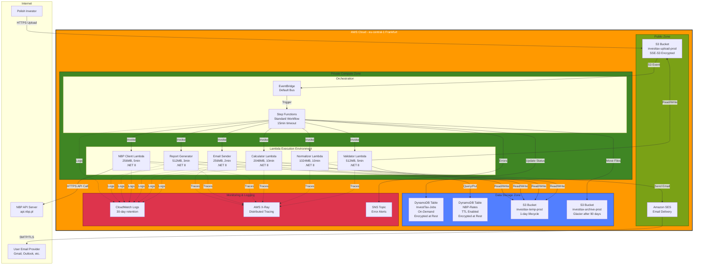

# Deployment Architecture

[← Back to Index](README.md)

## Deployment Diagram



---

## Overview

The InvestTax Calculator is deployed entirely within the **AWS eu-central-1 (Frankfurt)** region to comply with GDPR requirements for processing data of Polish residents. The architecture is **fully serverless**, leveraging AWS managed services to eliminate operational overhead.

**Deployment Strategy**: Infrastructure as Code (AWS CDK) with multi-environment support (dev, staging, production).

---

## AWS Region Selection

### Primary Region: eu-central-1 (Frankfurt)

**Rationale**:
- **Geographic Proximity**: Closest AWS region to Poland (Warsaw)
- **GDPR Compliance**: EU data residency requirement
- **Latency**: < 30ms from Poland to Frankfurt
- **Service Availability**: All required services available
- **NBP API Access**: No geo-restrictions from EU region

**Alternative Considered**: eu-west-1 (Ireland)
- **Rejected**: Slightly higher latency (~50ms)
- **Retained as DR Region** (Phase 2): Cross-region backup

---

## Environments

### 1. Development Environment
**AWS Account**: Separate development account  
**Purpose**: Feature development and testing

**Configuration**:
- **S3 Bucket Names**: `investtax-upload-dev`, `investtax-temp-dev`, `investtax-archive-dev`
- **DynamoDB Tables**: `InvestTax-Jobs-Dev`, `InvestTax-NBP-Rates-Dev`
- **SES**: Sandbox mode (verified email addresses only)
- **Step Functions**: `InvestTax-ProcessingWorkflow-Dev`
- **Cost**: ~$10-20/month (minimal usage)

**Access**:
- Developers have full admin access
- No production data

---

### 2. Staging Environment
**AWS Account**: Same as production (different stack)  
**Purpose**: Pre-production testing and integration tests

**Configuration**:
- **S3 Bucket Names**: `investtax-upload-staging`, etc.
- **DynamoDB Tables**: `InvestTax-Jobs-Staging`, etc.
- **SES**: Production mode (verified domain)
- **Mirrored Configuration**: Identical to production

**Access**:
- Developers read-only
- CI/CD pipeline full access
- QA team upload access

**Data**: Anonymized production data for realistic testing

---

### 3. Production Environment
**AWS Account**: Dedicated production account  
**Purpose**: Live system serving end users

**Configuration**:
- **S3 Bucket Names**: `investtax-upload-prod`, `investtax-temp-prod`, `investtax-archive-prod`
- **DynamoDB Tables**: `InvestTax-Jobs`, `InvestTax-NBP-Rates`
- **SES**: Production mode (verified domain, production quota)
- **Step Functions**: `InvestTax-ProcessingWorkflow`
- **High Availability**: Multi-AZ (automatic for AWS services)

**Access**:
- Strict IAM policies (principle of least privilege)
- CloudTrail logging all API calls
- MFA required for console access

**Cost**: ~$100-500/month (depends on usage)

---

## Network Architecture

### VPC Configuration (Phase 2)

**Current (Phase 1)**: Lambda functions run in default AWS network (no VPC)

**Future (Phase 2)**: Lambda functions in VPC for enhanced security

**VPC Design**:
- **CIDR**: `10.0.0.0/16`
- **Subnets**:
  - **Private Subnets** (Lambda): `10.0.1.0/24`, `10.0.2.0/24` (Multi-AZ)
  - **Public Subnets** (NAT Gateway): `10.0.101.0/24`, `10.0.102.0/24`
- **NAT Gateway**: For Lambda to access NBP API (HTTPS outbound)
- **VPC Endpoints**:
  - S3 (Gateway Endpoint): Free, no internet traffic
  - DynamoDB (Gateway Endpoint): Free, no internet traffic
  - SES (Interface Endpoint): $0.01/hour per AZ

**Benefits of VPC**:
- Network isolation (no direct internet access)
- Private subnets for Lambda
- Tighter security groups

**Drawbacks**:
- Additional cost (NAT Gateway: ~$30/month)
- Increased cold start time (~500ms)
- More complex networking

**Decision**: Defer to Phase 2 (low security risk in Phase 1)

---

### Security Groups (Phase 2)

**Lambda Security Group**:
- **Outbound Rules**:
  - HTTPS (443) to NBP API (0.0.0.0/0)
  - HTTPS (443) to S3 via VPC endpoint
  - HTTPS (443) to DynamoDB via VPC endpoint
  - SMTP (587) to SES via VPC endpoint
- **Inbound Rules**: None (Lambda doesn't accept inbound connections)

---

## Compute Infrastructure

### AWS Lambda Configuration

**Runtime**: Python 3.12  
**Architecture**: x86_64 (arm64 considered for Phase 2 cost savings)

**Function Sizing**:

| Function | Memory | Timeout | Concurrency | Estimated Cost/Invocation |
|----------|--------|---------|-------------|---------------------------|
| Validator | 512 MB | 5 min | 10 | $0.0008 |
| Normalizer | 1024 MB | 10 min | 10 | $0.0025 |
| NBP Client | 256 MB | 5 min | 100 | $0.0002 |
| Calculator | 2048 MB | 10 min | 10 | $0.0050 |
| Report Generator | 512 MB | 3 min | 10 | $0.0005 |
| Email Sender | 256 MB | 2 min | 10 | $0.0001 |

**Concurrency Limits**:
- **Reserved Concurrency**: Set per function to avoid runaway costs
- **Account Limit**: 1000 concurrent executions (default)
- **Expected Usage**: < 50 concurrent (peak: tax season)

**Environment Variables**:
- `STAGE`: dev/staging/prod
- `JOBS_TABLE_NAME`: DynamoDB table name
- `RATES_TABLE_NAME`: NBP cache table name
- `TEMP_BUCKET`: S3 temp bucket name
- `ARCHIVE_BUCKET`: S3 archive bucket name
- `FROM_EMAIL`: SES sender address
- `LOG_LEVEL`: INFO/DEBUG

**Lambda Layers**:
- **Layer 1**: Common libraries (`boto3`, `requests`, `pandas`)
  - Size: ~50 MB
  - Shared across all functions
  - Reduces deployment package size
- **Layer 2** (Calculator only): `numpy` for numerical computing
  - Size: ~70 MB

**Cold Start Mitigation**:
- Provisioned Concurrency: NOT used (cost > benefit for low-volume)
- Lambda SnapStart: .NET supports SnapStart for even faster cold starts (alternative to Native AOT)
- Optimization: Minimize imports, lazy loading

---

### Step Functions State Machine

**Type**: Standard Workflow (long-running, exactly-once execution)  
**Execution Limit**: 1 year (far exceeds 15-minute workflow)

**State Machine Definition** (simplified):
```json
{
  "StartAt": "ExtractMetadata",
  "States": {
    "ExtractMetadata": {
      "Type": "Task",
      "Resource": "arn:aws:states:::dynamodb:putItem",
      "Next": "ValidateCSV"
    },
    "ValidateCSV": {
      "Type": "Task",
      "Resource": "arn:aws:lambda:eu-central-1:123456789012:function:InvestTax-ValidateCSV",
      "Retry": [{"ErrorEquals": ["States.ALL"], "MaxAttempts": 3}],
      "Catch": [{"ErrorEquals": ["ValidationError"], "Next": "SendErrorEmail"}],
      "Next": "NormalizeData"
    },
    "NormalizeData": { "Type": "Task", "Next": "FetchNBPRates" },
    "FetchNBPRates": { "Type": "Task", "Next": "CalculateTax" },
    "CalculateTax": { "Type": "Task", "Next": "GenerateReport" },
    "GenerateReport": { "Type": "Task", "Next": "SendEmail" },
    "SendEmail": { "Type": "Task", "Next": "ArchiveAndCleanup" },
    "ArchiveAndCleanup": { "Type": "Task", "End": true },
    "SendErrorEmail": { "Type": "Task", "End": true }
  }
}
```

**Execution ARN Pattern**: `arn:aws:states:eu-central-1:123456789012:execution:InvestTax-ProcessingWorkflow:550e8400-e29b-41d4-a716-446655440000`

**Monitoring**:
- CloudWatch Logs for execution history
- X-Ray integration for distributed tracing
- EventBridge rule for failed executions → SNS alert

**Cost**: $0.025 per 1000 state transitions (~$0.0002 per file)

---

## Data Storage Infrastructure

### Amazon S3 Buckets

#### Upload Bucket: `investtax-upload-prod`
**Purpose**: Receives user-uploaded CSV files

**Configuration**:
- **Encryption**: SSE-S3 (AES-256)
- **Versioning**: Disabled (single-use files)
- **Public Access**: Blocked
- **Lifecycle Policy**: Delete objects after 7 days
- **Event Notification**: S3 PUT → EventBridge rule
- **Bucket Policy**:
  ```json
  {
    "Version": "2012-10-17",
    "Statement": [{
      "Effect": "Deny",
      "Principal": "*",
      "Action": "s3:PutObject",
      "Resource": "arn:aws:s3:::investtax-upload-prod/*",
      "Condition": {
        "StringNotEquals": {
          "s3:x-amz-server-side-encryption": "AES256"
        }
      }
    }]
  }
  ```

**Access**:
- Upload: Authenticated AWS users or federated identity
- Read: Validator Lambda only

**Monitoring**: CloudWatch metric for object count (alert if > 1000 pending)

---

#### Temp Bucket: `investtax-temp-prod`
**Purpose**: Intermediate processing files

**Configuration**:
- **Encryption**: SSE-S3
- **Lifecycle**: Delete all objects after 1 day (aggressive cleanup)
- **Public Access**: Blocked
- **Versioning**: Disabled

**File Patterns**:
- `validated-{job_id}.csv`
- `normalized-{job_id}.json`
- `rates-{job_id}.json`
- `calculation-{job_id}.json`
- `report-{job_id}.html`
- `report-{job_id}.txt`

**Access**: All Lambda functions (read/write)

---

#### Archive Bucket: `investtax-archive-prod`
**Purpose**: Long-term retention for audit and re-processing

**Configuration**:
- **Encryption**: SSE-S3
- **Versioning**: Enabled (accidental delete protection)
- **Public Access**: Blocked
- **Lifecycle Transitions**:
  - Day 0-30: S3 Standard
  - Day 30-90: S3 Standard-IA (Infrequent Access)
  - Day 90-365: S3 Glacier Instant Retrieval
  - Day 365+: Delete (configurable per compliance requirements)

**File Structure**:
```
2024/
  550e8400-e29b-41d4-a716-446655440000/
    original.csv
    report.html
    calculation.json
    metadata.json
```

**Access**: Read-only for Lambda, admin access for debugging

**Cost Optimization**:
- Standard: $0.023/GB/month
- Standard-IA: $0.0125/GB/month (after 30 days)
- Glacier: $0.004/GB/month (after 90 days)
- Estimated: $5-10/month for 100 files/month

---

### Amazon DynamoDB Tables

#### Jobs Table: `InvestTax-Jobs`
**Purpose**: Job tracking and status management

**Schema**:
- **Partition Key**: `job_id` (String)
- **Attributes**: See [Component Architecture](component-architecture.md#component-job-tracker-dynamodb)

**Configuration**:
- **Capacity Mode**: On-Demand (pay per request)
- **Encryption**: AWS Managed Key (free)
- **Point-in-Time Recovery**: Enabled (restore any point in last 35 days)
- **TTL Attribute**: `ttl` (Unix timestamp, 30 days after completion)
- **Global Secondary Index**:
  - **Name**: `email-upload_time-index`
  - **Partition Key**: `email`
  - **Sort Key**: `upload_time`
  - **Projection**: ALL
  - **Purpose**: Query user's job history (Phase 2 feature)

**Scaling**:
- Auto-scales to any load (On-Demand mode)
- No throttling concerns
- Consistent single-digit millisecond latency

**Cost**: $1.25 per million writes, $0.25 per million reads  
**Estimated**: $2-5/month (100-1000 jobs)

---

#### NBP Rates Cache: `InvestTax-NBP-Rates`
**Purpose**: Caches NBP exchange rates to reduce API calls

**Schema**:
- **Partition Key**: `cache_key` (String, format: `{currency}#{date}`)
- **Attributes**: `rate`, `fetched_at`, `ttl`

**Configuration**:
- **Capacity Mode**: On-Demand
- **Encryption**: AWS Managed Key
- **TTL**: Enabled (automatic cleanup after 30 days)

**Performance**:
- 99% of reads served in < 5ms
- Cache hit rate: 80-95%
- Reduces NBP API calls by 90%

**Cost**: ~$1-2/month (low read/write volume)

---

## Email Infrastructure

### Amazon SES

**Configuration**:
- **Region**: eu-central-1 (must match Lambda region)
- **Verified Domain**: `investtax.example.com`
  - DKIM records added to DNS
  - SPF: `v=spf1 include:amazonses.com ~all`
  - DMARC: `v=DMARC1; p=quarantine; rua=mailto:dmarc@investtax.example.com`
- **Verified Email**: `noreply@investtax.example.com`

**Production Access**:
- Request production access (move out of sandbox)
- Justify use case to AWS support
- Provide bounce/complaint handling plan

**Sending Limits** (production):
- **Send Rate**: 14 emails/second (default, can request increase)
- **Daily Quota**: 50,000 emails/day (default)
- **Expected Usage**: < 1000 emails/day (even in peak tax season)

**Configuration Set**: `InvestTax-Emails`
- Event Publishing: Bounce, complaint, delivery to SNS topics
- Reputation Metrics: Track bounce rate, complaint rate

**Bounce/Complaint Handling**:
- SNS Topic: `InvestTax-EmailBounces`, `InvestTax-EmailComplaints`
- Lambda Subscriber: Logs bounced emails, future suppression list

**Cost**: $0.10 per 1000 emails  
**Estimated**: $0.10-1.00/month

---

## Monitoring & Observability

### Amazon CloudWatch

#### Logs
**Log Groups**: One per Lambda function + Step Functions  
**Retention**: 30 days (configurable)

**Log Format**: Structured JSON for easy parsing
```json
{
  "timestamp": "2025-01-15T10:30:15.123Z",
  "level": "INFO",
  "jobId": "550e8400-e29b-41d4-a716-446655440000",
  "component": "Calculator",
  "message": "Starting FIFO calculation",
  "context": {}
}
```

**Log Insights Queries**:
- Failed jobs: `filter status = "FAILED" | stats count() by error_message`
- Slow functions: `filter duration > 10000 | stats avg(duration) by function`
- NBP cache hits: `filter message like /cache hit/ | stats count()`

---

#### Metrics

**System Metrics** (automatic):
- Lambda invocations, duration, errors, throttles
- Step Functions execution count, success/failure rate
- DynamoDB consumed capacity, throttled requests
- S3 bucket size, object count
- SES bounce rate, complaint rate

**Custom Metrics** (Lambda code):
- `JobsProcessed` (count)
- `AverageProcessingTime` (milliseconds)
- `NBPCacheHitRate` (percentage)
- `ValidationErrors` (count by error type)

---

#### Alarms

**Critical Alarms** (SNS → PagerDuty/Email):
| Alarm | Threshold | Action |
|-------|-----------|--------|
| Lambda errors > 5% | 3 datapoints in 5 min | Page on-call engineer |
| Step Functions failures > 10/hour | 1 datapoint | Page on-call |
| DynamoDB throttled requests > 0 | 2 datapoints in 5 min | Page on-call |
| SES bounce rate > 10% | 1 datapoint in 1 hour | Email admin |
| NBP API errors > 20% | 3 datapoints in 10 min | Email admin |

**Warning Alarms** (SNS → Email only):
| Alarm | Threshold | Action |
|-------|-----------|--------|
| S3 upload bucket > 1000 objects | 1 datapoint | Email admin (investigate stalled jobs) |
| Average processing time > 10 min | 3 datapoints in 30 min | Email admin |
| Daily email volume < 5 | 1 datapoint per day | Email admin (possible issue) |

---

#### Dashboard

**Custom CloudWatch Dashboard**: `InvestTax-Overview`

**Widgets**:
1. **System Health**: Success/failure rate (last 24 hours)
2. **Processing Volume**: Jobs processed per hour (last 7 days)
3. **Performance**: Average processing time per stage
4. **Errors**: Top 5 error types (last 24 hours)
5. **NBP Integration**: Cache hit rate, API latency
6. **Costs**: Estimated spend (last 30 days)

**Access**: Public read-only link for transparency

---

### AWS X-Ray

**Enabled Services**:
- All Lambda functions
- Step Functions
- DynamoDB (via SDK instrumentation)
- HTTP calls (NBP API)

**Sampling Rule**: 100% (all requests traced in Phase 1)

**Service Map**: Visual representation of component interactions
- Nodes: Lambda functions, DynamoDB, S3, NBP API
- Edges: Request count, latency, error rate
- Latency breakdown: Time spent in each component

**Trace Details**:
- End-to-end latency from upload to email
- Subsegments for each processing stage
- Annotations for job ID, year, transaction count
- Metadata for debugging (file size, NBP cache hits)

**Use Cases**:
- Identify bottleneck stages (is calculation or NBP fetch slow?)
- Debug failed executions (where did it fail?)
- Optimize Lambda cold starts

**Cost**: $0.50 per 100,000 traces (~$5/month in production)

---

## Security Infrastructure

### IAM Roles & Policies

**Principle**: Least privilege per component

#### Lambda Execution Roles

**Validator Lambda**:
```json
{
  "Version": "2012-10-17",
  "Statement": [
    {
      "Effect": "Allow",
      "Action": ["s3:GetObject"],
      "Resource": "arn:aws:s3:::investtax-upload-prod/*"
    },
    {
      "Effect": "Allow",
      "Action": ["s3:PutObject"],
      "Resource": "arn:aws:s3:::investtax-temp-prod/*"
    },
    {
      "Effect": "Allow",
      "Action": ["logs:CreateLogGroup", "logs:CreateLogStream", "logs:PutLogEvents"],
      "Resource": "*"
    }
  ]
}
```

**Calculator Lambda** (additional permissions):
```json
{
  "Effect": "Allow",
  "Action": ["dynamodb:GetItem", "dynamodb:PutItem"],
  "Resource": "arn:aws:dynamodb:eu-central-1:123456789012:table/InvestTax-NBP-Rates"
}
```

**Email Sender Lambda** (additional):
```json
{
  "Effect": "Allow",
  "Action": ["ses:SendEmail", "ses:SendRawEmail"],
  "Resource": "*"
}
```

---

#### Step Functions Execution Role

```json
{
  "Effect": "Allow",
  "Action": [
    "lambda:InvokeFunction",
    "dynamodb:PutItem",
    "dynamodb:UpdateItem",
    "s3:CopyObject",
    "s3:DeleteObject",
    "sns:Publish"
  ],
  "Resource": [
    "arn:aws:lambda:eu-central-1:123456789012:function:InvestTax-*",
    "arn:aws:dynamodb:eu-central-1:123456789012:table/InvestTax-Jobs",
    "arn:aws:s3:::investtax-*/*",
    "arn:aws:sns:eu-central-1:123456789012:InvestTax-Errors"
  ]
}
```

---

### Encryption

**Data at Rest**:
- **S3**: SSE-S3 (AES-256, default)
  - Future (Phase 2): SSE-KMS with customer-managed key for audit trail
- **DynamoDB**: Encryption at rest with AWS managed key
  - Future: Customer-managed KMS key
- **CloudWatch Logs**: Encrypted by default

**Data in Transit**:
- **S3 Upload**: HTTPS (TLS 1.2+) mandatory
- **Lambda → S3/DynamoDB**: AWS PrivateLink (encrypted within AWS)
- **Lambda → NBP API**: HTTPS (TLS 1.2+)
- **SES → Email Server**: STARTTLS (opportunistic encryption)

---

### AWS Secrets Manager (Phase 2)

**Current**: No secrets (NBP API is public, SES uses IAM)

**Future**: If adding authenticated APIs or database credentials
- Store API keys in Secrets Manager
- Lambda retrieves on cold start, caches for warm invocations
- Automatic rotation for supported secret types

---

## CI/CD Pipeline

### Source Control
**Repository**: GitHub (`investtax/calculator`)  
**Branches**:
- `main`: Production-ready code
- `develop`: Integration branch
- `feature/*`: Feature branches

---

### Pipeline Stages

**Tool**: AWS CodePipeline + AWS CodeBuild

**1. Source Stage**:
- **Trigger**: Push to `develop` or `main` branch
- **Source**: GitHub connection (OAuth)

**2. Build Stage**:
- **Environment**: Amazon Linux 2023, .NET 8 runtime
- **Cold Start Optimization**: Native AOT compilation reduces cold starts from 300ms to <50ms
- **Steps**:
  - Restore dependencies: `dotnet restore`
  - Run linters: `dotnet format --verify-no-changes`
  - Run unit tests: `dotnet test --configuration Release`
  - Build Lambda packages: `dotnet lambda package --configuration Release`
  - Package Lambda functions: Zip with dependencies
  - CDK Synth: Generate CloudFormation templates

**3. Deploy to Dev**:
- **Target**: Development account
- **Action**: `cdk deploy --require-approval never`
- **Post-Deployment**: Run smoke tests

**4. Integration Tests**:
- **Action**: Upload sample CSV files to dev S3 bucket
- **Validation**: Check email delivery, job status in DynamoDB
- **Duration**: ~5 minutes

**5. Deploy to Staging**:
- **Target**: Staging environment (production account)
- **Action**: `cdk deploy InvestTaxStack-Staging`
- **Post-Deployment**: Full E2E test suite

**6. Manual Approval**:
- **Reviewer**: Team lead or senior engineer
- **Checks**: Review CloudWatch metrics, error logs, test results
- **SNS Notification**: Sent to approval group

**7. Deploy to Production**:
- **Target**: Production environment
- **Action**: `cdk deploy InvestTaxStack-Prod`
- **Post-Deployment**:
  - Canary deployment (10% traffic for 10 minutes)
  - Automatic rollback on alarm
  - Full deployment after validation

---

### Rollback Strategy

**Automatic Rollback**:
- CloudFormation stack rollback on resource creation failure
- Lambda alias shift-back if errors > 5%

**Manual Rollback**:
- Re-run pipeline from previous commit
- Update Lambda aliases to previous version
- Restore DynamoDB from point-in-time backup (if data corruption)

---

## Disaster Recovery

### Backup Strategy

**S3**:
- **Cross-Region Replication** (Phase 2): eu-central-1 → eu-west-1
  - Archive bucket only (upload/temp are ephemeral)
  - RPO: < 15 minutes
  - Cost: ~$0.02/GB replicated

**DynamoDB**:
- **Point-in-Time Recovery**: Enabled (restore any second in last 35 days)
- **On-Demand Backups**: Daily automated backup (retained 7 days)
  - RPO: 24 hours
  - RTO: 1 hour (manual restore required)

**Lambda**:
- Function code stored in S3 (versioned)
- CDK code in GitHub (version controlled)
- No backup needed (infrastructure as code)

**CloudWatch Logs**:
- Export to S3 (manual process)
- 30-day retention (configurable)

---

### Failure Scenarios

**Scenario 1: Lambda Function Crash**
- **Impact**: Single file processing failure
- **Detection**: Step Functions catches error, sends error email
- **Recovery**: User re-uploads file after fix deployed
- **RTO**: < 1 hour (manual rollback or bug fix)

**Scenario 2: NBP API Outage**
- **Impact**: Cannot fetch exchange rates
- **Detection**: CloudWatch alarm (NBP API errors > 20%)
- **Mitigation**: Rate cache serves 80-90% of requests
- **Recovery**: Wait for NBP API restoration, retry queue (Phase 2)
- **RTO**: Depends on NBP (out of our control)

**Scenario 3: DynamoDB Table Corruption**
- **Impact**: Lost job tracking data
- **Detection**: Unexpected errors reading/writing jobs
- **Recovery**: Restore from point-in-time backup
- **RTO**: 1-2 hours
- **RPO**: Minimal (last few minutes of data)

**Scenario 4: AWS Region Outage** (rare)
- **Impact**: Complete system unavailability
- **Phase 1**: No mitigation (accept downtime)
- **Phase 2**: Cross-region DR in eu-west-1
  - Route 53 health check → failover to DR region
  - DR stack pre-deployed (cold standby)
  - Manual activation required
- **RTO**: 4-8 hours
- **RPO**: < 1 hour (if cross-region replication enabled)

---

## Cost Estimation

### Monthly Cost Breakdown (Production, 1000 files/month)

| Service | Usage | Unit Cost | Monthly Cost |
|---------|-------|-----------|--------------|
| **Lambda** | 6000 invocations, 5 GB-hours | $0.20/million requests + $0.0000166667/GB-sec | $5 |
| **Step Functions** | 1000 executions, 8000 transitions | $0.025/1000 transitions | $0.20 |
| **S3 Storage** | 10 GB average | $0.023/GB | $0.23 |
| **S3 Requests** | 10K PUTs, 50K GETs | $0.005/1K PUT, $0.0004/1K GET | $0.07 |
| **DynamoDB** | 10K writes, 50K reads | $1.25/million writes, $0.25/million reads | $0.03 |
| **SES** | 1000 emails | $0.10/1K emails | $0.10 |
| **CloudWatch** | 5 GB logs | $0.50/GB ingested | $2.50 |
| **X-Ray** | 100K traces | $5.00/million traces | $0.50 |
| **Data Transfer** | 5 GB out (NBP + email) | $0.09/GB (first 10TB) | $0.45 |
| **VPC Costs** (Phase 2) | 1 NAT Gateway | $0.045/hour | $32.40 |
| **TOTAL** | | | **$9.08** (Phase 1)<br/>**$41.48** (Phase 2 with VPC) |

**Note**: Costs scale linearly with usage. At 10,000 files/month, estimated ~$90 (Phase 1).

---

## Infrastructure as Code (CDK)

### Stack Organization

**Repository**: `investtax-calculator-cdk/`

**Directories**:
```
bin/
  investtax.ts            # CDK app entry point
lib/
  storage-stack.ts        # S3 buckets, DynamoDB tables
  compute-stack.ts        # Lambda functions, layers
  orchestration-stack.ts  # Step Functions, EventBridge
  notification-stack.ts   # SES, SNS topics
  monitoring-stack.ts     # CloudWatch dashboards, alarms
test/
  unit/                   # Jest unit tests for constructs
  integration/            # E2E tests
cdk.json                  # CDK configuration
package.json              # Dependencies
```

**Deployment Command**:
```bash
cdk deploy InvestTaxStack-Prod --context stage=prod
```

**Stack Dependencies**:
1. Storage (S3, DynamoDB) → no dependencies
2. Compute (Lambda) → depends on Storage (bucket names)
3. Orchestration (Step Functions) → depends on Compute (function ARNs)
4. Notification (SES, SNS) → no dependencies
5. Monitoring (CloudWatch) → depends on all (resource ARNs)

---

## Next Steps

- **Processing Details**: See [Data Flow](data-flow.md) for stage-by-stage data transformation
- **User Journeys**: Review [Workflows](workflows.md) for sequence diagrams of key scenarios
- **Implementation Plan**: Check [Phased Development](phased-development.md) for MVP vs. full feature rollout

---

[← Back to Index](README.md) | [← Previous: Component Architecture](component-architecture.md) | [Next: Data Flow →](data-flow.md)
