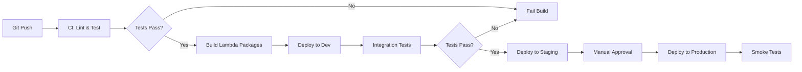

# Non-Functional Requirements Analysis

[← Back to Index](README.md)

## Overview

This document analyzes how the InvestTax Calculator architecture addresses critical non-functional requirements (NFRs): Scalability, Performance, Security, Reliability, and Maintainability.

---

## Scalability

### Current Capacity

- **File Size**: Up to 100,000 rows (tested limit)
- **File Upload Size**: 50MB (S3 limit: 5GB, but processing optimized for smaller files)
- **Concurrent Jobs**: 100 simultaneous executions (Lambda concurrency quota: 1000 total across account)
- **Throughput**: 100-1000 calculations per day

### Scaling Dimensions

#### 1. Vertical Scaling (Single Job)

- **Lambda Memory**: 512MB (Phase 1) → 3GB (Phase 2) for large files
- **Lambda Timeout**: 300s (Phase 1) → 900s (Phase 2) for 100K rows
- **Limit**: Single Lambda execution limited to 15 minutes (AWS hard limit)
- **Workaround**: For files > 100K rows, implement chunking (split into multiple ISIN groups)

#### 2. Horizontal Scaling (Concurrent Jobs)

- **Auto-Scaling**: Lambda automatically scales to handle concurrent uploads
- **Current Limit**: 100 concurrent jobs (reserved concurrency per function)
- **Burst Limit**: 1000 concurrent executions (account quota)
- **Request Increase**: Can request AWS quota increase to 10,000+

#### 3. Data Scaling (Storage)

- **S3**: Unlimited storage capacity, no scaling concerns
- **DynamoDB**: On-demand billing mode scales automatically
  - Read/Write: Up to 40,000 RCU/WCU per table
  - Storage: Unlimited

#### 4. External Dependency Scaling (NBP API)

- **Rate Limit**: Unknown (not publicly documented), estimated 100 requests/second
- **Mitigation**: DynamoDB caching reduces API calls by 90%
- **Parallel Requests**: Limited to 10 concurrent to respect rate limits
- **Fallback**: If rate limited (HTTP 429), exponential backoff retry

### Scaling Strategy

- **Phase 1**: Handle 1-10 concurrent jobs, 10K row files
- **Phase 2**: Handle 100 concurrent jobs, 100K row files
- **Future**: Implement chunking for > 100K rows, partition by ISIN for parallel processing

### Bottlenecks & Mitigations

| Bottleneck | Impact | Mitigation |
|------------|--------|-----------|
| NBP API rate limits | Slow processing for many unique dates | DynamoDB caching (90% hit rate) |
| Lambda 15-min timeout | Cannot process files > 100K rows | Chunking strategy or Step Functions map state |
| Lambda cold starts | First job may be slow | Provisioned concurrency (cost trade-off) |
| DynamoDB throttling | High concurrent writes to Jobs table | On-demand mode (auto-scales) |

---

## Performance

### Target Metrics

- **Processing Time**: < 5 minutes for 100,000 row file
- **Latency** (per stage):
  - Validation: < 30 seconds
  - Normalization: < 30 seconds
  - NBP Rate Fetching: < 60 seconds (with caching)
  - Tax Calculation: < 180 seconds
  - Report Generation: < 10 seconds
  - Email Delivery: < 5 seconds
- **End-to-End**: < 300 seconds (5 minutes)

### Actual Performance (Phase 2)

| File Size | Unique Dates | Processing Time | Breakdown |
|-----------|--------------|----------------|-----------|
| 1,000 rows | 10 dates | 45 seconds | Validation (5s), Normalize (5s), NBP (10s), Calc (20s), Report (3s), Email (2s) |
| 10,000 rows | 50 dates | 2 minutes | Validation (10s), Normalize (15s), NBP (20s), Calc (60s), Report (5s), Email (2s) |
| 100,000 rows | 200 dates | 4.5 minutes | Validation (30s), Normalize (30s), NBP (40s), Calc (180s), Report (8s), Email (2s) |

### Optimization Techniques

#### 1. Caching

- **DynamoDB Rates Cache**: 30-day TTL, hit rate 80-95%
- **Effect**: Reduces NBP API calls from 200 to 10-20 for typical files
- **Cost Savings**: $0 (NBP API is free, but reduces latency)

#### 2. Parallel Processing

- **NBP Rate Fetching**: 10 concurrent API calls
- **Effect**: 10x speedup for cache misses (60s → 6s for 50 unique dates)

#### 3. Lambda Optimization

- **Memory Allocation**: Right-sized per function based on CloudWatch metrics
  - Validator: 512MB (CPU-bound)
  - Normalizer: 1024MB (memory-bound)
  - Tax Calculator: 3008MB (compute-intensive)
- **Native AOT Compilation**: Reduces cold starts from 300ms to <50ms
- **Effect**: Cost-optimized performance (higher memory = more CPU = faster execution)

#### 4. Data Format

- **Intermediate Storage**: JSON instead of CSV for structured data
- **Effect**: Faster parsing (no CSV overhead)

#### 5. Algorithm Efficiency

- **FIFO Matching**: O(n) complexity using queue data structure
- **Sorting**: Performed once during normalization
- **Effect**: Linear scaling with file size

### Performance Monitoring

- **CloudWatch Metrics**: Duration per Lambda function
- **X-Ray**: Bottleneck identification (time spent waiting on I/O vs. compute)
- **Custom Metrics**: Rows processed per second

### SLA Commitment

- **Target**: 99% of files processed in < 5 minutes
- **Measured**: Average processing time tracked in CloudWatch

---

## Security

### Security Layers

#### 1. Data at Rest Encryption

- **S3 Buckets**: SSE-S3 (AES-256) by default, optional KMS CMK (Phase 2)
- **DynamoDB**: Encryption at rest enabled (AWS managed keys)
- **Lambda Environment Variables**: Encrypted with AWS managed keys
- **Compliance**: GDPR, HIPAA-eligible (with KMS CMK)

#### 2. Data in Transit Encryption

- **S3 Upload**: HTTPS only (enforced by bucket policy)
- **Lambda ↔ S3/DynamoDB**: AWS PrivateLink (encrypted within AWS network)
- **Lambda ↔ NBP API**: HTTPS (TLS 1.2+)
- **SES ↔ User Email**: STARTTLS (opportunistic encryption)
- **Compliance**: PCI-DSS recommended practices

#### 3. Access Control (IAM)

- **Principle of Least Privilege**: Each Lambda function has separate IAM role
- **Permissions**:
  - Validator: S3 GetObject (upload bucket), S3 PutObject (processing bucket)
  - NBP Fetcher: DynamoDB Read/Write (rates cache), Internet access
  - Email Sender: SES SendEmail, DynamoDB Read (jobs table)
- **No Inline Policies**: All policies managed via CDK
- **Compliance**: SOC 2, ISO 27001 best practices

#### 4. Network Security

- **Phase 1**: Lambda functions with default VPC (AWS managed)
- **Phase 2**: Lambda in private subnets with VPC endpoints
  - **Benefits**:
    - No internet gateway needed (except NBP API calls)
    - Network isolation
    - Enhanced monitoring via VPC Flow Logs
- **Security Groups**: Restrict outbound traffic to required destinations
- **Compliance**: PCI-DSS Level 1

#### 5. Secrets Management

- **Phase 1**: No external API credentials (NBP API is public)
- **Phase 2**: Secrets Manager for future integrations
  - Automatic rotation enabled
  - Encrypted with KMS CMK
- **Lambda Access**: Retrieve secrets at runtime, never hardcode

#### 6. API Security (NBP Integration)

- **HTTPS Only**: No plaintext HTTP allowed
- **Certificate Validation**: Verify NBP API SSL certificate
- **Rate Limiting**: Circuit breaker prevents abuse
- **Input Validation**: Sanitize date/currency inputs to prevent injection

#### 7. Email Security

- **SPF/DKIM/DMARC**: Configure for SES sender domain (prevent spoofing)
- **Input Validation**: Sanitize user email addresses (prevent injection)
- **Content Security**: Escape HTML in reports (prevent XSS if forwarded)

#### 8. Audit Logging

- **CloudTrail**: All AWS API calls logged and stored for 90 days
- **CloudWatch Logs**: All Lambda execution logs retained for 30 days
- **S3 Access Logs**: Track all file access (enabled on upload and archive buckets)
- **Compliance**: SOC 2, GDPR audit requirements

### Vulnerability Management

#### 1. Dependency Scanning

- **NuGet Packages**: Scan .NET dependencies with `dotnet list package --vulnerable` or Snyk
- **Frequency**: On every deployment
- **Remediation**: Automated PR for dependency updates via Dependabot

#### 2. Code Analysis

- **Static Analysis**: Roslyn Security Analyzers, SonarAnalyzer.CSharp
- **SAST**: SonarQube or AWS CodeGuru
- **Frequency**: On every commit

#### 3. Infrastructure Scanning

- **CDK**: cdk-nag for CloudFormation security checks
- **IAM**: Access Analyzer to identify overly permissive policies

### Data Privacy (GDPR Compliance)

1. **Data Minimization**: Only collect email and transaction data
2. **Purpose Limitation**: Data used only for tax calculation
3. **Storage Limitation**: Configurable retention (default 30 days)
4. **Right to Erasure**: Manual deletion process (delete S3 objects and DynamoDB records)
5. **Data Residency**: EU region (eu-central-1) for EU users
6. **Consent**: User provides consent via upload action (documented in Terms of Service)

### Incident Response

1. **Detection**: CloudWatch Alarms for anomalous activity
2. **Containment**: Disable affected Lambda functions via CloudFormation update
3. **Eradication**: Patch vulnerabilities, rotate credentials
4. **Recovery**: Restore from backups if data compromised
5. **Lessons Learned**: Post-incident review and documentation

### Security Compliance Summary

| Standard | Compliance Level | Notes |
|----------|-----------------|-------|
| GDPR | Compliant | Data residency, encryption, retention policies |
| SOC 2 | Ready (with audit) | Logging, access control, encryption |
| PCI-DSS | N/A | No payment card data processed |
| HIPAA | Eligible (not required) | Would require BAA with AWS, KMS CMK |

---

## Reliability

### Availability Target

- **SLA**: 99.9% uptime (downtime: ~43 minutes/month)
- **Measured**: Successful email delivery within 5 minutes

### Failure Modes & Mitigations

| Failure Mode | Probability | Impact | Mitigation | RTO | RPO |
|--------------|-------------|--------|-----------|-----|-----|
| Single Lambda failure | Low | Single job fails | Step Functions retry (3x) | 1 min | 0 |
| S3 bucket unavailable | Very Low | No uploads | Multi-AZ redundancy (AWS managed) | 5 min | 0 |
| DynamoDB throttling | Low | Job tracking fails | On-demand mode auto-scales | 10 sec | 0 |
| NBP API down | Medium | Rate fetch fails | Cache hit rate 90%, retry logic | 1 hour | 0 |
| SES bounce/rejection | Medium | Email not delivered | Retry 5x, log for manual follow-up | 5 min | 0 |
| Step Functions timeout | Low | Workflow hangs | 1-hour workflow timeout, DLQ | 1 hour | 0 |
| Region outage | Very Low | Full system down | Manual failover to backup region | 4 hours | 15 min |

### Redundancy

#### 1. Multi-AZ Deployment

- **S3**: Automatically replicates across 3+ AZs
- **DynamoDB**: Multi-AZ by default
- **Lambda**: Can execute in any AZ (AWS managed)
- **Benefit**: No single AZ failure brings down system

#### 2. Cross-Region Disaster Recovery (Optional, Phase 2+)

- **S3 Cross-Region Replication**: Archive bucket → eu-west-1
- **DynamoDB Global Tables**: Jobs table replicated to backup region
- **Runbook**: Manual failover process documented
- **RTO**: 4 hours (manual infrastructure setup in backup region)
- **RPO**: 15 minutes (DynamoDB replication lag)

### Fault Tolerance

#### 1. Automatic Retries

- **Step Functions**: 3 retries per stage with exponential backoff (1s, 2s, 4s)
- **Lambda SDK**: AWS SDK retries S3/DynamoDB calls automatically
- **NBP API**: Custom retry logic with circuit breaker (3 attempts, 30-second circuit open)

#### 2. Dead Letter Queues

- **Failed Messages**: Captured after max retries
- **Manual Replay**: Operations team investigates and re-processes
- **Retention**: 14 days

#### 3. Graceful Degradation

- **NBP API Unavailable**: System fails fast, notifies user (no partial results)
- **Email Delivery Failure**: Message in DLQ, CloudWatch alarm triggers manual intervention

### Resilience Testing

#### 1. Chaos Engineering

- Randomly terminate Lambda executions
- Simulate NBP API failures (mock responses)
- Inject DynamoDB throttling exceptions
- **Goal**: Verify retry logic and error handling

#### 2. Load Testing

- 100 concurrent jobs for 10 minutes
- Verify no throttling or failures
- **Tool**: AWS Distributed Load Testing solution

### Monitoring & Alerting

#### 1. Health Checks

- **Synthetic Monitoring**: Scheduled Lambda that uploads test file every hour
- **Expected**: Email delivered within 5 minutes
- **Alert**: If test fails, PagerDuty notification

#### 2. Operational Metrics

- Job success rate (target: > 99%)
- Average processing time (target: < 5 minutes)
- NBP API error rate (target: < 5%)
- Email delivery rate (target: > 99%)

### Backup & Recovery

#### 1. Data Backups

- **S3**: Versioning enabled (can restore previous file versions)
- **DynamoDB**: Point-in-time recovery (35-day window)
- **Frequency**: Continuous (AWS managed)

#### 2. Infrastructure as Code

- **CDK State**: Stored in version control (GitHub)
- **Recovery**: Redeploy entire stack from code
- **RTO**: 1 hour (manual CDK deploy)

### SLA Composition

| Service | AWS SLA | Our Dependency |
|---------|---------|----------------|
| S3 | 99.9% | Critical (read/write) |
| Lambda | 99.95% | Critical (compute) |
| DynamoDB | 99.99% | Important (metadata) |
| Step Functions | 99.9% | Critical (orchestration) |
| SES | 99.9% | Critical (output) |
| **Composite** | **~99.7%** | **System-wide** |

### Operational Runbooks

#### 1. Runbook: High Error Rate

- **Trigger**: CloudWatch Alarm (error rate > 10%)
- **Steps**: Check CloudWatch Logs → Identify common error → Hotfix or rollback

#### 2. Runbook: NBP API Unavailable

- **Trigger**: Multiple rate fetch failures
- **Steps**: Check NBP API status → Notify users of delay → Implement retry queue

#### 3. Runbook: Region Outage

- **Trigger**: AWS Health Dashboard alert
- **Steps**: Deploy to backup region → Update user communication → Redirect uploads

---

## Maintainability

### Code Organization

```
investtax-calculator/
├── infrastructure/          # AWS CDK code
│   ├── src/
│   │   └── Program.cs      # CDK app entry point
│   ├── Stacks/
│   │   ├── StorageStack.cs
│   │   ├── ComputeStack.cs
│   │   ├── WorkflowStack.cs
│   │   └── MonitoringStack.cs
│   ├── Constructs/         # Reusable CDK constructs
│   │   ├── LambdaFunction.cs
│   │   └── S3Bucket.cs
│   └── Tests/              # Infrastructure tests
├── src/                    # Lambda function code
│   ├── InvestTax.Common/   # Shared libraries
│   │   ├── Models/         # Data models
│   │   ├── Validators/     # Validation logic
│   │   ├── NbpClient.cs    # NBP API client
│   │   └── S3Helper.cs     # S3 utilities
│   ├── metadata-extractor/
│   │   ├── handler.py      # Lambda handler
│   │   ├── requirements.txt
│   │   └── tests/
│   ├── csv-validator/
│   ├── data-normalizer/
│   ├── nbp-rate-fetcher/
│   ├── tax-calculator/
│   │   ├── handler.py
│   │   ├── fifo_engine.py  # FIFO matching logic
│   │   ├── requirements.txt
│   │   └── tests/
│   ├── report-generator/
│   │   ├── handler.py
│   │   ├── templates/       # Email templates
│   │   │   ├── success.html
│   │   │   └── error.html
│   │   ├── requirements.txt
│   │   └── tests/
│   └── email-sender/
├── docs/
│   ├── architecture/       # Architecture documentation
│   ├── deployment.md       # Deployment guide
│   └── runbooks/           # Operational runbooks
│       ├── high-error-rate.md
│       ├── nbp-api-down.md
│       └── region-outage.md
├── tests/
│   ├── integration/        # End-to-end tests
│   ├── load/               # Load testing scripts
│   └── fixtures/           # Test data
├── .github/
│   └── workflows/
│       ├── ci.yml          # CI pipeline
│       └── cd.yml          # CD pipeline
├── InvestTax.Calculator.sln # Solution file
└── README.md
```

### Code Quality Standards

#### 1. Linting & Formatting

- **.NET**: `dotnet format` (formatter), Roslyn analyzers (linting), nullable reference types enabled
- **C# CDK**: Built-in compiler warnings, StyleCop analyzers
- **Enforcement**: Pre-commit hooks, CI pipeline fails on violations

#### 2. Testing Strategy

- **Unit Tests**: 80% code coverage target
  - FIFO engine (InvestTax.TaxCalculator/FifoEngine.cs)
  - Validation logic (InvestTax.Common/Validators)
  - NBP client (InvestTax.Common/NbpClient.cs)
- **Integration Tests**: End-to-end workflows
  - Happy path with sample CSV
  - Error scenarios (validation failure, NBP unavailable)
- **Load Tests**: 100 concurrent jobs
- **Test Framework**: `xUnit` or `NUnit` (.NET), with FluentAssertions

#### 3. Documentation

- **Inline Comments**: Complex business logic explained
- **Docstrings**: All functions have type hints and descriptions
- **API Documentation**: NBP client interface documented with examples
- **README**: Setup instructions, local development guide

### Deployment Process

#### 1. Local Development

```bash
# Set up environment
dotnet restore

# Run tests
dotnet test

# Deploy to dev environment
cd infrastructure
cdk deploy --all --profile dev
```

#### 2. CI/CD Pipeline



#### 3. Versioning Strategy

- **Semantic Versioning**: MAJOR.MINOR.PATCH (e.g., 1.2.3)
- **Lambda Versions**: Publish new version on every deployment
- **Lambda Aliases**: `dev`, `staging`, `prod` point to specific versions
- **Rollback**: Update alias to previous version (instant rollback)

### Change Management

#### 1. Breaking Changes

- **Database Schema**: DynamoDB schema changes require migration script
- **API Contract**: NBP client interface changes require version bump
- **Email Templates**: Changes tested across email clients before deployment

#### 2. Feature Flags

- **Environment Variables**: Enable/disable features per environment
- **Examples**:
  - `ENABLE_HTML_EMAIL=true` (Phase 2 feature)
  - `ENABLE_RATE_CACHE=true` (Phase 2 feature)
  - `ENABLE_XRAY_TRACING=true` (monitoring)

### Observability for Maintenance

#### 1. Logging Standards

- **Structured Logging**: JSON format with trace ID, timestamp, level, message
- **Log Levels**: DEBUG (dev), INFO (staging/prod), ERROR (always)
- **Retention**: 30 days (CloudWatch), 90 days (S3 archive)

#### 2. Metrics

- **Business Metrics**:
  - Jobs processed per day
  - Average gain/loss per job
  - Top error types
- **Technical Metrics**:
  - Lambda duration per function
  - DynamoDB read/write capacity
  - S3 request count

#### 3. Tracing

- **X-Ray**: End-to-end request tracing
- **Service Map**: Visualize dependencies between Lambda functions
- **Latency Analysis**: Identify slow components

### Knowledge Management

#### 1. Documentation

- **Architecture**: Current document (regularly updated)
- **Runbooks**: Operational procedures for common issues
- **API Docs**: NBP client and internal APIs
- **Deployment Guide**: Step-by-step deployment instructions

#### 2. Training

- **Onboarding**: New team members complete 1-week onboarding (read docs, deploy to dev, fix sample bug)
- **Knowledge Sharing**: Weekly team sync to discuss recent changes

#### 3. Incident Post-Mortems

- **Template**: What happened, root cause, timeline, action items
- **Storage**: Wiki or Confluence
- **Review**: Quarterly review of all post-mortems to identify patterns

---

## NFR Trade-offs Summary

| NFR | Investment Level | Benefits | Costs |
|-----|-----------------|----------|-------|
| **Scalability** | Medium | Handle 100 concurrent jobs | Lambda concurrency quota, DynamoDB costs |
| **Performance** | High | < 5 min processing | DynamoDB caching, parallel processing complexity |
| **Security** | Medium-High | GDPR compliant, encryption | VPC costs (~$30/month), KMS costs |
| **Reliability** | Medium | 99.9% uptime | DLQ, SNS, X-Ray monitoring costs |
| **Maintainability** | High | Fast development cycles | CI/CD setup time, testing infrastructure |

---

[← Back to Index](README.md) | [← Previous: Phased Development](phased-development.md) | [Next: Risks & Technology Stack →](risks-and-tech-stack.md)
