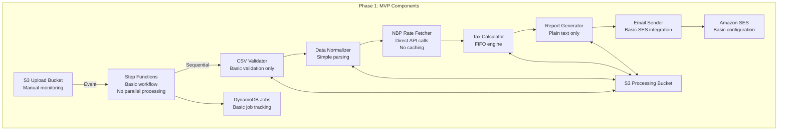
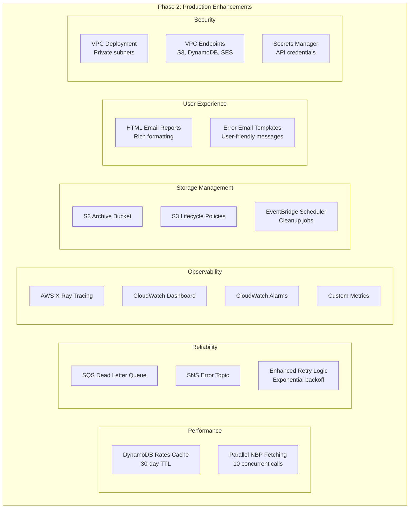

# Phased Development

[← Back to Index](README.md)

## Overview

Given the complexity of the InvestTax Calculator, implementation will be divided into two phases: an initial MVP focusing on core functionality and a final phase adding production-grade robustness and optimizations.

---

## Phase 1: Initial Implementation (MVP)

### Objective
Deliver a working end-to-end solution with core tax calculation capabilities, suitable for limited production use with manual operational support.

### Duration
**Timeline**: 2-3 weeks

**Team**:
- 1 Backend Engineer (Lambda functions, Step Functions)
- 1 DevOps/Infrastructure Engineer (AWS CDK, deployment)
- 1 QA/Test Engineer (test data, validation)

---

### Phase 1 Architecture Simplifications

#### Simplified Component Diagram



---

### Phase 1 Features

#### Included:

1. **Core Data Pipeline**:
   - S3 upload bucket with event notifications
   - Step Functions workflow (sequential stages, no parallelization)
   - CSV validation (structure, required fields, basic data types)
   - Data normalization (dates, currencies, numbers)
   - NBP API integration (direct calls, no caching)
   - FIFO tax calculation engine
   - Plain text report generation
   - Email delivery via SES

2. **Basic Error Handling**:
   - Validation errors sent to user via email
   - NBP API failures logged to CloudWatch
   - Step Functions automatic retries (3 attempts)

3. **Minimal Storage**:
   - DynamoDB Jobs table (job tracking)
   - S3 processing bucket (intermediate files)
   - No archival or retention policies

4. **Security Basics**:
   - S3 encryption at rest (SSE-S3)
   - HTTPS/TLS for all communication
   - IAM roles with basic permissions

#### Excluded (Deferred to Phase 2):

- ❌ NBP rate caching (DynamoDB Rates Cache)
- ❌ Parallel processing (concurrent NBP API calls)
- ❌ HTML email reports (plain text only)
- ❌ S3 Archive bucket and lifecycle policies
- ❌ EventBridge event bus
- ❌ SNS error notifications
- ❌ Dead Letter Queues
- ❌ X-Ray distributed tracing
- ❌ CloudWatch dashboards and alarms
- ❌ Comprehensive monitoring
- ❌ VPC deployment

---

### Phase 1 Simplified Workflow

1. User uploads CSV to S3
2. S3 event triggers Step Functions workflow
3. **Sequential processing**:
   - Validate CSV → Normalize → Fetch NBP rates (one at a time) → Calculate → Generate report → Send email
4. Each stage reads/writes from S3 Processing Bucket
5. Job status tracked in DynamoDB
6. User receives plain text email with results

**Limitations:**
- **Performance**: 5-10 minutes for 10K rows (no caching or parallelization)
- **Error Handling**: Basic email notifications, manual investigation required
- **Monitoring**: CloudWatch logs only, no dashboards
- **Scalability**: Handles 1-10 concurrent jobs comfortably

---

### Phase 1 Technology Stack

| Component | Technology | Configuration |
|-----------|-----------|---------------|
| Compute | AWS Lambda | .NET 8, 1GB memory, 300s timeout |
| Orchestration | AWS Step Functions | Standard workflow, basic retry policy |
| Storage | Amazon S3 | 2 buckets (upload, processing), SSE-S3 |
| Database | Amazon DynamoDB | Jobs table, on-demand billing |
| Email | Amazon SES | Sandbox mode (verified recipients) or production |
| Monitoring | Amazon CloudWatch | Logs only |
| Deployment | AWS CDK | Basic stack definition |

---

### Phase 1 Deployment

#### Infrastructure as Code:

```
investtax-infrastructure/
├── bin/
│   └── investtax-app.ts         # CDK app entry point
├── lib/
│   ├── storage-stack.ts         # S3 buckets
│   ├── compute-stack.ts         # Lambda functions
│   ├── workflow-stack.ts        # Step Functions
│   └── database-stack.ts        # DynamoDB tables
└── lambda/
    ├── metadata-extractor/
    ├── csv-validator/
    ├── data-normalizer/
    ├── nbp-rate-fetcher/
    ├── tax-calculator/
    ├── report-generator/
    └── email-sender/
```

#### Deployment Steps:

1. `cdk bootstrap` (one-time)
2. `cdk deploy InvestTaxStorageStack`
3. `cdk deploy InvestTaxComputeStack`
4. `cdk deploy InvestTaxWorkflowStack`
5. Manual SES verification (email address or domain)
6. Test with sample CSV file

#### Week-by-Week Breakdown:

**Week 1: Foundation**
- Storage, compute, and database setup
- CSV validation and normalization implementation

**Week 2: Core Processing**
- NBP integration
- FIFO tax calculator implementation

**Week 3: Output & Testing**
- Report generation
- Email sending
- End-to-end testing

---

## Phase 2: Final Architecture (Production-Ready)

### Objective
Transform MVP into a production-grade system with performance optimizations, comprehensive monitoring, advanced error handling, and operational excellence.

### Duration
**Timeline**: 6-8 weeks

**Team**:
- 2 Backend Engineers (enhancements and optimization)
- 1 DevOps Engineer (CI/CD, VPC, monitoring)
- 1 QA Engineer (comprehensive testing)

---

### Phase 2 Enhancements

#### Component Additions:



---

### Phase 2 Feature Additions

#### 1. Performance Optimizations
- **NBP Rate Caching**: DynamoDB cache reduces API calls by 80-90%
- **Parallel Processing**: Concurrent NBP fetching (10 parallel requests)
- **Lambda Right-Sizing**: CloudWatch metrics-based memory optimization
- **Expected Impact**: Processing time reduced from 5-10 minutes to < 3 minutes for 10K rows

#### 2. Advanced Error Handling
- **Dead Letter Queues**: Failed messages preserved for manual replay
- **SNS Error Topic**: Aggregated error notifications to operations team
- **Comprehensive Error Templates**: User-friendly email templates for all error scenarios
- **Expected Impact**: 95% of errors self-documented for user resolution

#### 3. Comprehensive Monitoring
- **X-Ray Tracing**: End-to-end request tracing and bottleneck identification
- **CloudWatch Dashboards**: Real-time job status, error rates, processing times
- **CloudWatch Alarms**:
  - Job failure rate > 10%
  - NBP API error rate > 5%
  - Average processing time > 5 minutes
  - Email delivery failure rate > 1%
- **Custom Metrics**: Business KPIs (jobs processed, average gain/loss, file sizes)
- **Expected Impact**: MTTD < 5 minutes, MTTR < 30 minutes

#### 4. Data Lifecycle Management
- **S3 Archive Bucket**: Long-term retention with Glacier transition
- **Lifecycle Policies**:
  - Processing bucket: Delete after 7 days
  - Archive bucket: Standard (90 days) → Standard-IA (365 days) → Glacier (7 years)
- **EventBridge Scheduled Cleanup**: Daily job to clean expired DynamoDB records
- **Expected Impact**: Storage costs reduced by 70% long-term

#### 5. Enhanced User Experience
- **HTML Email Reports**: Rich formatting with tables, colors, charts
- **Responsive Design**: Mobile-friendly email templates
- **PDF Report Attachment** (optional): Downloadable PDF summary
- **Expected Impact**: User satisfaction increase, fewer support inquiries

#### 6. Security Hardening
- **VPC Deployment**: Lambda functions in private subnets
- **VPC Endpoints**: Private communication with S3, DynamoDB, SES
- **Secrets Manager**: NBP API credentials (if authentication added)
- **KMS Customer Managed Keys**: Enhanced encryption control
- **Expected Impact**: Compliance-ready (GDPR, SOC 2)

#### 7. Operational Excellence
- **Automated Deployment Pipeline**: CI/CD with GitHub Actions or CodePipeline
- **Blue/Green Deployment**: Zero-downtime Lambda updates
- **Canary Releases**: Gradual traffic shift for new versions
- **Automated Testing**: Integration tests run on every deployment
- **Expected Impact**: Deployment frequency increased to weekly with confidence

---

### Phase 2 Migration Path

#### Week-by-Week Implementation:

**Week 1: Performance Optimizations**
1. Create DynamoDB Rates Cache table
2. Update NBP Rate Fetcher Lambda:
   - Add cache lookup logic
   - Implement parallel API calls
3. Test: Verify 3-5x speedup for cached scenarios
4. Deploy to production with monitoring

**Week 2: Enhanced Monitoring**
1. Enable X-Ray tracing for all Lambda functions
2. Create CloudWatch Dashboard:
   - Job status distribution (pie chart)
   - Average processing time (line chart)
   - Error rates per stage (bar chart)
3. Configure CloudWatch Alarms
4. Test: Simulate failures, verify alerts

**Week 3: Advanced Error Handling**
1. Create SNS Error Topic
2. Create SQS Dead Letter Queue
3. Update Step Functions workflow:
   - Add DLQ configuration
   - Add SNS error notifications
4. Create error email templates
5. Test: Force failures, verify error emails

**Week 4: Data Lifecycle Management**
1. Create S3 Archive Bucket
2. Configure S3 Lifecycle Policies
3. Create EventBridge scheduled rules for cleanup
4. Update Step Functions to include archival step
5. Test: Verify files transition correctly

**Week 5: HTML Reports & UX**
1. Create HTML email templates
2. Update Report Generator Lambda
3. Test: Verify rendering across email clients (Gmail, Outlook, Apple Mail)
4. Deploy to production

**Week 6: Security Hardening** (Optional)
1. Create VPC with private subnets
2. Create VPC Endpoints (S3, DynamoDB, SES)
3. Update Lambda functions to VPC configuration
4. Create KMS Customer Managed Key
5. Update S3 buckets to use KMS encryption
6. Test: Verify connectivity and performance

**Week 7: CI/CD Pipeline**
1. Set up GitHub Actions or CodePipeline
2. Configure automated testing (unit + integration)
3. Implement blue/green deployment for Lambda
4. Configure canary deployment strategy
5. Test: Deploy via pipeline, verify zero downtime

**Week 8: Final Testing & Documentation**
1. End-to-end testing with 100K row files
2. Load testing (10 concurrent jobs)
3. Disaster recovery testing (simulate region failure)
4. Update operational runbooks
5. User documentation and FAQ

---

### Migration Path Summary

| Capability | Phase 1 | Phase 2 | Migration Effort |
|------------|---------|---------|------------------|
| Processing Time | 5-10 min | < 3 min | Medium (caching + parallelization) |
| Error Handling | Basic email | SNS + DLQ + templates | Medium (infrastructure + templates) |
| Monitoring | CloudWatch logs | X-Ray + Dashboards + Alarms | Medium (configuration) |
| Email Format | Plain text | HTML + Plain text | Low (templates) |
| Security | Basic IAM | VPC + KMS + Secrets Manager | High (network reconfiguration) |
| Data Retention | No policy | Lifecycle to Glacier | Low (lifecycle rules) |
| Deployment | Manual CDK | CI/CD with canary | High (pipeline setup) |
| Cost (monthly) | $50-100 | $150-300 | N/A |

---

### Key Decision Points

**Security Hardening (VPC)**:
- **When to implement**: Only if compliance requires network isolation (PCI-DSS, HIPAA)
- **Trade-off**: Additional cost (~$30/month for NAT Gateway), increased complexity
- **Recommendation**: Defer unless compliance mandates

**CI/CD Pipeline**:
- **When to implement**: Essential for production but can start with manual deployments
- **Trade-off**: Upfront setup time vs. long-term deployment safety
- **Recommendation**: Implement by Week 7 of Phase 2

**HTML Reports**:
- **When to implement**: High user value, low implementation cost
- **Trade-off**: None (clear win)
- **Recommendation**: Prioritize early in Phase 2 (Week 5)

---

## Next Steps

- **Implementation Details**: See [Implementation Guide](implementation-guide.md) for step-by-step instructions
- **Performance Analysis**: Review [NFR Analysis](nfr-analysis.md) for detailed scalability and performance considerations
- **Risk Assessment**: Check [Risks & Technology Stack](risks-and-tech-stack.md) for potential issues and mitigations

---

[← Back to Index](README.md) | [← Previous: Workflows](workflows.md) | [Next: NFR Analysis →](nfr-analysis.md)