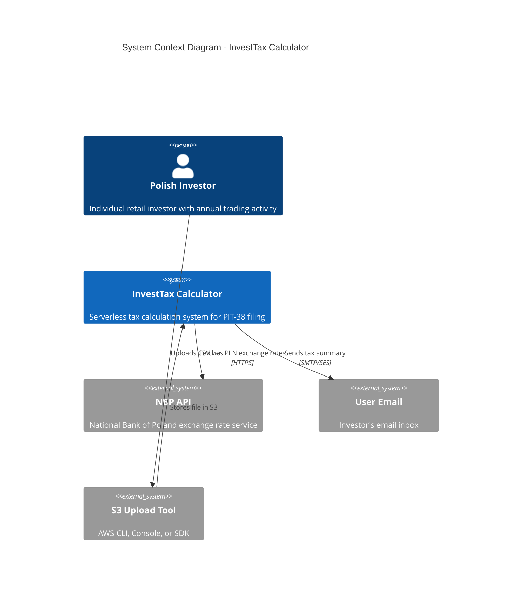

# System Context

[← Back to Index](README.md)

## System Context Diagram



---

## Overview

The InvestTax Calculator operates as a standalone serverless system within the AWS cloud, accepting CSV files containing annual trading transactions and producing PIT-38 tax calculation summaries delivered via email.

**Key Characteristic**: The system has minimal external dependencies and integrations, focusing on a clear file-in → processing → email-out workflow.

---

## External Actors

### 1. Polish Investor (Primary User)
**Type**: Human actor  
**Role**: End user of the system

**Responsibilities**:
- Prepares annual transaction history in CSV format
- Uploads file to designated S3 bucket with email metadata
- Receives tax calculation summary via email
- Reviews results for PIT-38 filing

**Technical Requirements**:
- Access to any S3-compatible upload tool (AWS Console, CLI, SDK, or third-party S3 browser)
- Valid email address for receiving results
- Understanding of CSV format requirements (pipe-delimited)

**Assumptions**:
- User has basic technical literacy
- User trusts email delivery for sensitive tax information
- User is Polish tax resident (PIT-38 jurisdiction)

---

### 2. NBP API (External System)
**Type**: External web service  
**Role**: Authoritative source for PLN exchange rates

**Provided Service**:
- Historical exchange rates for foreign currencies to PLN
- Official rates published by National Bank of Poland
- RESTful API endpoint: `https://api.nbp.pl/api/exchangerates/`

**Integration Details**:
- **Protocol**: HTTPS REST API (GET requests)
- **Authentication**: None (public API)
- **Rate Limiting**: Unknown (estimated ~100 req/s)
- **Availability**: High but not guaranteed (no SLA)
- **Data Format**: JSON responses

**Critical Dependency**: 
- System cannot proceed without NBP rates for transaction dates
- Missing rates (weekends/holidays) cause workflow failure
- **Mitigation**: DynamoDB caching reduces dependency by 80-90%

**Example API Call**:
```
GET https://api.nbp.pl/api/exchangerates/rates/a/USD/2025-03-15/
Response: {"rates": [{"mid": 3.9876}]}
```

---

### 3. User Email System (External System)
**Type**: SMTP mail server  
**Role**: Final destination for calculation results

**Characteristics**:
- Owned and operated by user (Gmail, Outlook, corporate exchange)
- Receives emails from Amazon SES
- Subject to email filtering, spam detection

**Delivery Considerations**:
- **Success Rate**: Target > 99% (SES handles retries)
- **Deliverability**: Depends on SES domain reputation, SPF/DKIM/DMARC configuration
- **User Experience**: Email arrives in seconds to minutes after processing

---

### 4. S3 Upload Tool (User Interface)
**Type**: Client application or command-line tool  
**Role**: Mechanism for users to upload files to S3

**Options**:
1. **AWS Console**: Web browser-based upload
   - User-friendly for non-technical users
   - Requires AWS account authentication
   - Supports metadata entry (email address)

2. **AWS CLI**: Command-line upload
   - For power users and automation
   - Example: `aws s3 cp transactions.csv s3://investtax-upload/ --metadata email=user@example.com`

3. **AWS SDK**: Programmatic upload
   - For custom integrations
   - Python, JavaScript, Java, etc.

4. **Third-Party S3 Browsers**: Cyberduck, S3 Browser, etc.
   - GUI alternatives to AWS Console
   - Must support metadata headers

**Integration Point**: Upload triggers S3 PUT event, which initiates processing workflow.

---

## System Boundary

### What's Inside the System

The InvestTax Calculator encompasses:

✅ **Processing Logic**:
- CSV validation and parsing
- Data normalization (dates, currencies, numbers)
- FIFO tax calculation engine
- Report generation (HTML/text)

✅ **Data Storage**:
- Uploaded files (S3)
- Intermediate processing results (S3)
- Job tracking metadata (DynamoDB)
- Exchange rate cache (DynamoDB)

✅ **Orchestration**:
- Workflow management (Step Functions)
- Error handling and retries
- State persistence

✅ **Integration**:
- NBP API client (with caching)
- Email delivery (via SES)

✅ **Monitoring**:
- Logging (CloudWatch)
- Metrics and alarms
- Distributed tracing (X-Ray)

---

### What's Outside the System

The system explicitly **does NOT** include:

❌ **User Management**:
- No authentication or authorization
- No user accounts or profiles
- Anonymous access model (email is the only user identifier)

❌ **Broker Integrations**:
- No direct connections to Trading212, Interactive Brokers, etc.
- Users must manually export transaction history
- No automatic transaction sync

❌ **Government Systems**:
- No direct filing with Polish tax authorities
- No integration with e-Deklaracje or ePUAP
- Report is informational only; user files manually

❌ **Web Portal**:
- No user-facing website or dashboard
- No login interface
- No status tracking UI (results delivered only via email)

❌ **Manual Data Entry**:
- No forms for entering transactions individually
- File upload is the only input method

❌ **Tax Advisory**:
- No interpretation of tax law
- No personalized advice
- Disclaimer states tool is informational only

---

## Interactions

### 1. Input: File Upload
**Flow**: Investor → S3 Upload Tool → InvestTax Calculator

**Protocol**: HTTPS (S3 API)  
**Data Format**: Pipe-delimited CSV with specific header columns  
**Metadata**: Email address in S3 object metadata (`x-amz-meta-email`)

**Requirements**:
- Required columns: Action, Time, ISIN, Ticker, No. of shares, Price/share, Currency, etc.
- Email metadata must be present and valid

**Validation**: System performs extensive validation in first processing stage.

---

### 2. External Data: NBP Exchange Rates
**Flow**: InvestTax Calculator → NBP API

**Protocol**: HTTPS REST (GET requests)  
**Frequency**: Once per unique (date, currency) pair in file (reduced by caching)  
**Data Format**: JSON response with exchange rates

**Caching Strategy**:
- DynamoDB stores rates with 30-day TTL
- 80-95% cache hit rate for typical files
- Reduces NBP API calls from 100-200 to 5-20 per file

**Error Handling**:
- Rate unavailable (404): Send error email to user
- API timeout: Retry 3 times with exponential backoff
- Rate limiting (429): Back off and retry

---

### 3. Output: Email Delivery
**Flow**: InvestTax Calculator → Amazon SES → User Email

**Protocol**: SMTP over TLS  
**Content**: HTML and plain text versions  
**Delivery Time**: Seconds to minutes after processing

**Email Structure**:
- **From**: `noreply@investtax.example.com` (verified SES sender)
- **To**: User email from file metadata
- **Subject**: `Your InvestTax PIT-38 Calculation Results - {year}`
- **Body**: Rich HTML with transaction breakdown, methodology, disclaimer
- **Attachments**: None (all content in email body)

---

### 4. Error Handling Communication
**Flow**: InvestTax Calculator → User Email

**Scenarios**:
- **Validation Errors**: Row/column-specific issues with fixes
- **Missing NBP Rates**: Date/currency pairs unavailable
- **Calculation Errors**: Generic error with support contact

**Error Email Template**:
- User-friendly explanation (no technical jargon)
- Specific actionable guidance
- Examples of correct format where applicable
- Link/instructions for re-upload

---

## Design Rationale

### Why Serverless Architecture?
**Decision**: Use AWS Lambda and managed services instead of EC2 or containers.

**Rationale**:
- **Variable workload**: Tax calculations are seasonal (peak: January-April)
- **No idle costs**: Pay only when processing files
- **Automatic scaling**: Handle 1 or 100 concurrent uploads without configuration
- **Reduced operations**: No server patching, OS updates, or capacity planning

**Trade-offs**: 
- ⚠️ Cold start latency (mitigated by acceptable processing time)
- ⚠️ 15-minute Lambda timeout (limits single-file size to ~100K rows)

---

### Why S3-Based Intake?
**Decision**: Users upload directly to S3 instead of custom API endpoint.

**Rationale**:
- **Simplicity**: No need to build file upload API
- **Reliability**: S3 provides 99.99% availability
- **Scalability**: S3 handles any file size (up to 5TB)
- **Cost**: S3 storage extremely cheap ($0.023/GB/month)
- **Event-driven**: S3 natively triggers Lambda/Step Functions

**Trade-offs**:
- ⚠️ Requires AWS account or S3-compatible tooling
- ⚠️ Less user-friendly than web form upload
- ✅ Mitigated by providing clear CLI examples and documentation

---

### Why Email-Based Output?
**Decision**: Deliver results via email instead of web portal or downloadable file.

**Rationale**:
- **Permanent Record**: Email stored in user's inbox for filing
- **No Authentication**: Avoids complexity of user accounts and login
- **Universal Access**: Everyone has email, no app installation
- **Notification**: Email alerts user when processing complete
- **Cost**: Near-zero cost ($0.10 per 1000 emails)

**Trade-offs**:
- ⚠️ No real-time status updates (user waits for email)
- ⚠️ Sensitive tax data in email (mitigated by email encryption standards)
- ✅ User can forward/archive as needed

---

### Why NBP API Integration?
**Decision**: Use NBP official rates instead of alternative sources or manual entry.

**Rationale**:
- **Compliance**: Polish tax authorities require NBP rates for PIT-38
- **Authority**: Only authoritative source for official PLN rates
- **Free**: No cost for API access
- **Historical Data**: Full historical rate database

**Trade-offs**:
- ⚠️ No SLA or availability guarantee
- ⚠️ Missing rates for weekends/holidays
- ✅ Mitigated by caching and clear user communication on failures

---

## Security Considerations

### Data in Transit
- **User → S3**: HTTPS (TLS 1.2+)
- **System → NBP**: HTTPS (TLS 1.2+)
- **System → Email**: STARTTLS (opportunistic encryption)
- **Within AWS**: PrivateLink (encrypted network)

### Data at Rest
- **S3 Files**: SSE-S3 (AES-256 encryption)
- **DynamoDB**: Encryption at rest enabled
- **Retention**: Configurable (default 30 days)

### Access Control
- **No public access**: S3 buckets block public reads
- **IAM Least Privilege**: Each Lambda has minimal required permissions
- **No hardcoded secrets**: NBP API is public (no credentials)

---

## Next Steps

- **Component Details**: See [Component Architecture](component-architecture.md) for internal structure
- **Data Processing**: Review [Data Flow](data-flow.md) for stage-by-stage transformation
- **Deployment**: Check [Deployment Architecture](deployment-architecture.md) for AWS infrastructure

---

[← Back to Index](README.md) | [← Previous: Overview](overview.md) | [Next: Component Architecture →](component-architecture.md)
