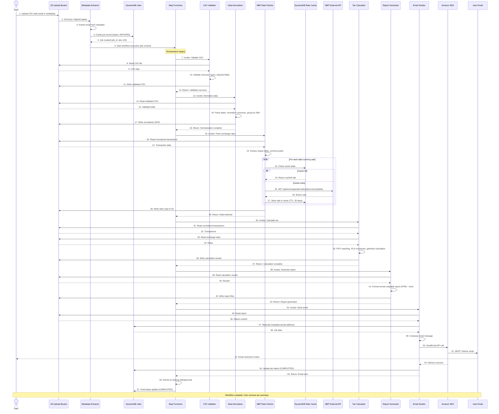
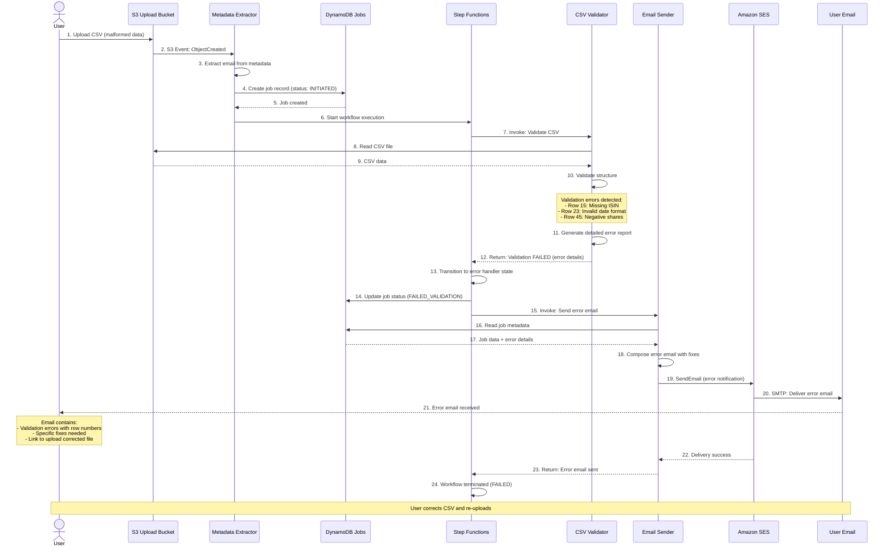
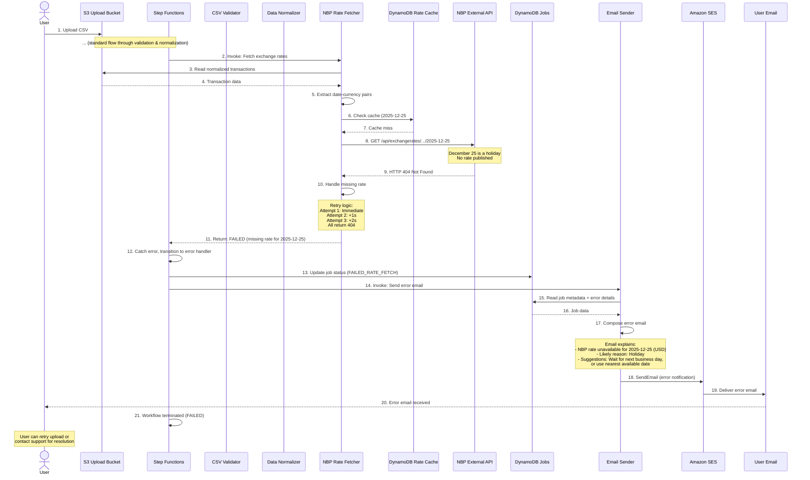

# Workflows

[← Back to Index](README.md)

## Overview

This document describes the key user journeys and system workflows through sequence diagrams, illustrating how different components interact to process tax calculations and handle error scenarios.

**Three Primary Workflows**:
1. **Happy Path**: Successful end-to-end processing
2. **Error Path - Validation Failure**: User data quality issues
3. **Error Path - NBP Rate Unavailable**: External dependency failures

---

## Workflow 1: Happy Path - Successful Calculation

### Overview
This sequence represents the ideal scenario where a user uploads a valid CSV file, all processing stages complete successfully, and the user receives their tax calculation summary via email.

### Sequence Diagram



---

### Step-by-Step Explanation

#### Initialization Phase (Steps 1-6)
**Duration**: ~500ms

1. **User Upload**: User uploads CSV file to S3 bucket
   - File name pattern: `2024/{uuid}.csv`
   - Required metadata: `x-amz-meta-email: user@example.com`

2. **S3 Event Trigger**: S3 emits ObjectCreated event to EventBridge

3. **Metadata Extraction**: EventBridge rule triggers metadata extraction
   - Parses email from S3 object metadata
   - Extracts year from file path
   - Generates unique job ID (UUID)

4-5. **Job Initialization**: Create tracking record in DynamoDB
   - Initial status: INITIATED
   - Stores job ID, email, upload time, file key

6. **Workflow Start**: Step Functions execution begins
   - Input: Job ID, email, file location
   - Orchestrates all subsequent stages

---

#### Validation Phase (Steps 7-12)
**Duration**: ~10-20 seconds for typical files

7-9. **File Download**: Validator Lambda downloads CSV from S3

10. **Validation Logic**:
   - **File Structure**: UTF-8 encoding, pipe-delimited, row count
   - **Headers**: Required columns present and correctly named
   - **Data Types**: Each column validated against expected type
   - **Business Rules**: Dates within year, sell quantities not exceeding buys

11. **Write Validated Data**: Store validated CSV in temp bucket

12. **Return Success**: Validator confirms file is clean

---

#### Normalization Phase (Steps 13-18)
**Duration**: ~10-15 seconds for typical files

13-15. **Load Validated Data**: Normalizer reads validated CSV

16. **Data Transformations**:
   - **Dates**: Parse ISO 8601 → datetime objects in Europe/Warsaw timezone
   - **Numbers**: String → Decimal (avoid float errors), round to 2 decimals
   - **Currencies**: Uppercase, validate against ISO 4217
   - **Grouping**: Sort by timestamp, group by ISIN

17. **Write Normalized JSON**: More structured format for downstream processing

18. **Return Success**: Normalization complete

---

#### Exchange Rate Fetching Phase (Steps 19-29)
**Duration**: ~1-60 seconds (depends on cache hit rate)

19-22. **Prepare Rate Requests**: NBP Fetcher extracts unique (date, currency) pairs
   - Example: 100 transactions might have 20 unique dates × 3 currencies = 60 pairs
   - Deduplication reduces API calls

23-27. **Rate Retrieval Loop** (parallel execution):
   - **Cache Check**: Query DynamoDB for `{currency}#{date}` key
   - **Cache Hit** (~80-90%): Return rate immediately
   - **Cache Miss**:
     - Call NBP API: `GET https://api.nbp.pl/api/exchangerates/rates/a/USD/2024-03-15/`
     - Parse response: `{rates: [{mid: 3.9876}]}`
     - Store in cache with 30-day TTL

28-29. **Save Rate Map**: Write complete rate lookup to S3

---

#### Tax Calculation Phase (Steps 30-37)
**Duration**: ~30-60 seconds for typical files

30-34. **Load Inputs**: Tax Calculator reads normalized transactions and exchange rates

35. **FIFO Calculation**:
   - For each ISIN group:
     - Maintain buy queue (FIFO)
     - For each sell:
       - Match with earliest unmatched buy
       - Convert both prices to PLN using NBP rates
       - Calculate gain = sell_PLN - buy_PLN
       - Track matched pairs
   - Sum all gains
   - Apply 19% tax rate

36-37. **Save Results**: Write calculation detail to S3

---

#### Report Generation Phase (Steps 38-43)
**Duration**: ~1-2 seconds

38-40. **Load Calculation**: Report Generator reads results

41. **Format Reports**:
   - **HTML Version**: Styled tables, color-coded gains, Bootstrap CSS
   - **Plain Text Version**: ASCII tables for text-only email clients
   - **Content**: Summary stats, matched transactions, methodology, disclaimer

42-43. **Save Reports**: Write both HTML and text versions to S3

---

#### Email Delivery Phase (Steps 44-55)
**Duration**: ~1-2 seconds

44-48. **Prepare Email**: Email Sender loads report and job metadata

49. **Compose Email**:
   - **Subject**: "Your InvestTax PIT-38 Calculation Results - 2024"
   - **From**: `noreply@investtax.example.com`
   - **To**: User email from metadata
   - **Body**: HTML + plain text (multipart MIME)

50-53. **Send via SES**:
   - SES API call with multipart message
   - SMTP delivery to user's email provider
   - User receives email in inbox

54-55. **Update Status**: Mark job as COMPLETED in DynamoDB

---

#### Cleanup Phase (Steps 56-57)
**Duration**: ~2-3 seconds

56. **Archive & Cleanup**:
   - Copy original file and report to archive bucket
   - Delete temp files (validated CSV, normalized JSON, rates, etc.)
   - S3 lifecycle policies handle long-term retention

57. **Final Update**: Job status finalized in DynamoDB

---

### Total Duration
**Typical File (10K rows)**: ~2-3 minutes  
**Large File (100K rows)**: ~10-15 minutes

### Success Criteria
✅ User receives email with complete tax summary  
✅ All intermediate data archived for audit  
✅ Job status in DynamoDB: COMPLETED  
✅ No errors or retries needed

---

## Workflow 2: Error Path - Validation Failure

### Overview
This sequence demonstrates the system's response when a user uploads a CSV file with structural or data quality issues.

### Sequence Diagram



---

### Step-by-Step Explanation

#### Initialization (Steps 1-6)
Identical to happy path.

---

#### Validation Failure (Steps 7-12)

10. **Validation Errors Detected**:

**Row 15 Error**:
```
Column: ISIN
Value: (empty)
Error: Missing required field
Fix: Add valid 12-character ISIN (e.g., US0378331005)
```

**Row 23 Error**:
```
Column: Time
Value: 03/15/2024
Error: Invalid date format
Fix: Use ISO 8601 format: 2024-03-15T14:30:00.000
```

**Row 45 Error**:
```
Column: No. of shares
Value: -10
Error: Must be positive number
Fix: Change to positive value: 10
```

11. **Error Report Generation**: Validator compiles all errors with row/column details

12. **Return Failure**: Step Functions receives validation failure with error payload

---

#### Error Handling (Steps 13-14)

13. **Error Handler State**: Step Functions catches validation error via Catch block in state machine

14. **Update Job Status**: DynamoDB record updated to `FAILED_VALIDATION`
   - Error details stored in `error_message` field
   - Job marked with failure timestamp

---

#### Error Email (Steps 15-23)

18. **Error Email Composition**:

```
Subject: InvestTax Calculation Failed - Validation Errors

Dear User,

We were unable to process your tax calculation file due to data validation errors.

ERRORS FOUND:
-------------
Row 15, Column ISIN: Missing required field
  → Fix: Add a valid 12-character ISIN (e.g., US0378331005)

Row 23, Column Time: Invalid date format ("03/15/2024")
  → Fix: Use ISO 8601 format: 2024-03-15T14:30:00.000

Row 45, Column No. of shares: Negative value (-10)
  → Fix: Change to positive number (10)

NEXT STEPS:
-----------
1. Correct the errors in your CSV file
2. Re-upload the corrected file to the same S3 bucket
3. You will receive a new calculation when processing completes

For detailed CSV format requirements, see:
[Documentation Link]

If you need assistance, contact support@investtax.example.com

Best regards,
InvestTax Calculator Team
```

---

### User Recovery Process

1. **User Reviews Error Email**: Clear, actionable guidance for each error

2. **User Corrects CSV**: Updates file based on specific error messages

3. **User Re-Uploads**: New file uploaded to S3
   - New job ID generated
   - Fresh workflow execution
   - No manual intervention needed

4. **Success on Retry**: Corrected file processes successfully

---

### Design Principles

✅ **Fail Fast**: Stop processing at first validation failure (no wasted resources)  
✅ **Actionable Errors**: Row/column-specific guidance  
✅ **User-Friendly**: No technical jargon, clear fixes  
✅ **Self-Service Recovery**: User can fix and retry without support  

---

## Workflow 3: Error Path - NBP Rate Unavailable

### Overview
This sequence shows how the system handles external dependency failures, specifically when the NBP API doesn't have exchange rates for a requested date (e.g., weekends, holidays).

### Sequence Diagram



---

### Step-by-Step Explanation

#### Processing Through Normalization (Steps 1-2)
Validation and normalization complete successfully. File structure is valid.

---

#### Rate Fetching Failure (Steps 3-11)

5. **Extract Rate Requests**: NBP Fetcher identifies need for `2025-12-25, USD` rate

6-7. **Cache Miss**: DynamoDB cache doesn't have this rate (never fetched before)

8-9. **NBP API Call Fails**:
```
Request: GET https://api.nbp.pl/api/exchangerates/rates/a/USD/2025-12-25/
Response: HTTP 404 Not Found
Body: {
  "error": "No data available for the specified date"
}
```

**Root Cause**: December 25 is Christmas (Polish public holiday). NBP does not publish exchange rates on non-business days.

10. **Retry Logic**:
- **Attempt 1**: Immediate retry → 404
- **Wait 1 second**
- **Attempt 2**: Retry → 404
- **Wait 2 seconds**
- **Attempt 3**: Final retry → 404
- **Give Up**: All retries exhausted

11. **Return Failure**: NBP Fetcher reports missing rate to Step Functions

---

#### Error Handling (Steps 12-13)

12. **Error Handler**: Step Functions Catch block intercepts `RateNotFoundException`

13. **Update Job Status**: DynamoDB updated to `FAILED_RATE_FETCH`
   - Error message: "NBP rate unavailable for USD on 2025-12-25"

---

#### Error Email (Steps 14-20)

17. **Error Email Composition**:

```
Subject: InvestTax Calculation Failed - Missing Exchange Rate

Dear User,

We were unable to complete your tax calculation because an exchange rate is unavailable.

MISSING RATE:
-------------
Currency: USD
Date: 2025-12-25 (December 25, 2024)

REASON:
-------
The National Bank of Poland (NBP) does not publish exchange rates on weekends and public holidays.
December 25 is Christmas, a Polish public holiday.

WHAT THIS MEANS:
----------------
Your CSV file contains a transaction dated 2025-12-25, but NBP has no official exchange rate for that date.

RESOLUTION OPTIONS:
-------------------
1. WAIT & RETRY: NBP may publish rates retrospectively within a few days. Wait 1-2 business days and re-upload your file.

2. CHECK TRANSACTION DATE: Verify the transaction date is correct. If it was executed on December 24 or 26, update your CSV.

3. CONTACT SUPPORT: If the date is correct and NBP does not publish a rate, contact support@investtax.example.com. We can assist with manual rate lookup.

For more information about NBP exchange rates, visit:
https://api.nbp.pl/en.html

Best regards,
InvestTax Calculator Team
```

---

### Resolution Paths

#### Option 1: Wait & Retry
- NBP sometimes publishes rates late (rare but possible)
- User waits 1-2 days
- Re-uploads same file
- System retries rate fetch
- If rate now available, processing succeeds

#### Option 2: Correct Transaction Date
- User verifies transaction actually occurred on December 24 or 26
- Updates CSV with correct date
- Re-uploads corrected file
- Processing succeeds with correct date

#### Option 3: Support Intervention (Future Feature - Phase 2)
- User contacts support
- Support manually looks up nearest available rate (e.g., December 24)
- Support approves using approximation
- Admin interface allows manual rate override
- Processing succeeds with manual rate

---

### Design Principles

✅ **Transparent Failure**: User knows exactly why calculation failed  
✅ **External Dependency Handling**: Graceful degradation when NBP unavailable  
✅ **User Guidance**: Clear options for resolution  
✅ **Operational Visibility**: CloudWatch alarm notifies team of NBP issues  

---

## Performance Characteristics

### Happy Path Performance

| File Size | Validation | Normalization | NBP Fetch | Calculation | Report | Email | Total |
|-----------|-----------|---------------|-----------|-------------|--------|-------|-------|
| **100 rows** | 2s | 1s | 0.5s | 1s | 0.5s | 0.5s | **~5s** |
| **10K rows** | 20s | 10s | 1s (90% cache) | 30s | 1s | 0.5s | **~63s** |
| **100K rows** | 180s | 120s | 5s | 480s | 5s | 0.5s | **~13 min** |

**Bottlenecks**:
- Tax calculation (FIFO algorithm, O(n²) worst case)
- NBP API calls (mitigated by caching)

**Optimization Opportunities**:
- Parallel tax calculation per ISIN group
- Lambda memory increase (faster CPU)
- Provisioned concurrency (eliminate cold starts)

---

### Error Path Performance

**Validation Failure**:
- Detection: ~2-20 seconds (stop at first stage)
- User notification: < 30 seconds total
- **Cost**: Minimal (only validation Lambda invoked)

**NBP Rate Failure**:
- Detection: ~10-60 seconds (retry logic adds delay)
- User notification: < 90 seconds total
- **Cost**: Moderate (processing up to rate fetch stage)

---

## Reliability Considerations

### Retry Strategy

**Step Functions Level**:
- Each state has retry config: 3 attempts, exponential backoff (1s, 2s, 4s)
- Catch blocks handle errors and route to error handler

**Lambda Level**:
- AWS SDK automatic retries (3 attempts for S3, DynamoDB)
- Custom retry for NBP API (3 attempts, circuit breaker pattern)

**Email Delivery**:
- SES SDK retries (5 attempts over 12 hours)
- Bounce/complaint handling via SNS

---

### Failure Scenarios & Recovery

| Failure | Detection | Recovery | User Impact |
|---------|-----------|----------|-------------|
| **Validation error** | Immediate | User fixes & re-uploads | Clear guidance, self-service |
| **NBP API down** | 3 retries (~7s) | Wait & retry later | Error email with explanation |
| **Lambda timeout** | 5-10 min (per stage) | Step Functions retry | Automatic retry, transparent |
| **DynamoDB throttle** | Immediate | Auto-scaling + retry | Transparent (rare) |
| **SES bounce** | Minutes to hours | SNS notification | Support contacts user |
| **S3 outage** | Immediate | AWS handles | Workflow pauses, auto-resumes |

---

## Monitoring & Observability

### CloudWatch Dashboards

**Real-Time Metrics**:
- Jobs in progress (by stage)
- Success vs. failure rate (last 24 hours)
- Average processing time per file size
- NBP cache hit rate
- Email delivery rate

### X-Ray Tracing

**Trace Segmentation**:
- Each workflow execution has unique trace ID
- Subsegments per Lambda invocation
- Latency breakdown by stage
- Annotations for job ID, file size, transaction count

**Sample Trace**:
```
Trace ID: 1-67c8a123-12345678901234567890abcd
Duration: 63.2s

Segments:
  - Upload Event → Step Functions: 5ms
  - Validation: 18.3s
  - Normalization: 9.7s
  - NBP Fetch: 1.2s (95% cache hits)
  - Calculation: 29.4s
  - Report Gen: 1.1s
  - Email Send: 0.8s
  - Archive/Cleanup: 2.7s
```

---

### Alarms

**Critical Alarms**:
- Step Functions failure rate > 5%
- Lambda errors > 10 per hour
- NBP API error rate > 20%
- DynamoDB throttled requests > 0

**Warning Alarms**:
- Average processing time > 10 minutes
- S3 upload bucket > 1000 pending files
- Email bounce rate > 5%

---

## Next Steps

- **Development Plan**: See [Phased Development](phased-development.md) for MVP vs. full feature roadmap
- **Performance Tuning**: Review [NFR Analysis](nfr-analysis.md) for scalability and optimization strategies
- **Risk Management**: Check [Risks & Technology Stack](risks-and-tech-stack.md) for potential issues and mitigations

---

[← Back to Index](README.md) | [← Previous: Data Flow](data-flow.md) | [Next: Phased Development →](phased-development.md)
